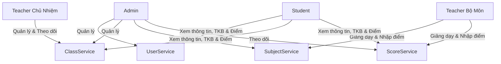

# University Management System - Detailed Business Requirements

## Tổng quan hệ thống
Hệ thống được chia thành 4 Microservices độc lập:

```text
UniversityManagement
├── UserService
├── ClassService
├── SubjectService
└── ScoreService
```
*Mỗi service sở hữu database riêng và chịu trách nhiệm cho một nhóm nghiệp vụ độc lập.*

---

## 1. UserService

### Mục tiêu
Quản lý toàn bộ người dùng trong hệ thống. Đây là service trung tâm chịu trách nhiệm:
- **Authentication** (Xác thực)
- **Authorization** (Phân quyền)
- **User Management** (Quản lý người dùng)

### Vai trò quản lý (Roles)
- **Admin**: Quản trị hệ thống.
- **Teacher**: Giáo viên.
- **Student**: Học sinh.

### Chức năng

#### Authentication
Cho phép:
- Đăng ký tài khoản
- Đăng nhập
- Tạo JWT Token
- Xác thực JWT
- Phân quyền Role

#### User Management
Quản lý:
- Mã người dùng
- Thông tin cá nhân
- Vai trò
- Trạng thái tài khoản

### Dữ liệu quản lý (User Schema)
- `Id`
- `UserCode`
- `Username`
- `Email`
- `PasswordHash`
- `FullName`
- `Gender`
- `DateOfBirth`
- `PhoneNumber`
- `Role`
- `CreatedAt`

### Phân quyền chi tiết
- **Quyền Admin**: Tạo người dùng, cập nhật người dùng, xóa người dùng, đổi Role, xem danh sách người dùng.
- **Quyền Teacher**: Xem hồ sơ cá nhân, cập nhật thông tin cá nhân.
- **Quyền Student**: Xem hồ sơ cá nhân, cập nhật thông tin cá nhân.

---

## 2. ClassService

### Mục tiêu
Quản lý lớp học và toàn bộ hoạt động liên quan đến lớp.

### Các đối tượng quản lý & Ví dụ
- **Class (Thông tin lớp học)**: `10A1`, `10A2`, `11A1`, `12A1`,...
- **StudentClass (Quản lý học sinh thuộc lớp)**: 
  - *Ví dụ*: Nguyễn Văn A $\rightarrow$ Năm học 2025-2026: lớp `10A1` $\rightarrow$ Năm học 2026-2027: lớp `11A1`.
- **HomeroomAssignment (Quản lý giáo viên chủ nhiệm)**:
  - *Ví dụ*: Teacher A $\rightarrow$ Năm học 2025-2026: chủ nhiệm `10A1` $\rightarrow$ Năm học 2026-2027: chủ nhiệm `11A1`.
- **TeachingAssignment (Quản lý giáo viên bộ môn)**:
  - *Ví dụ*: Lớp `10A1` $\rightarrow$ Môn Toán: Teacher A | Môn Văn: Teacher B.
- **Schedule (Quản lý thời khóa biểu)**:
  - *Ví dụ*: Thứ 2 $\rightarrow$ Tiết 1: Toán | Tiết 2: Văn.

### Chức năng chính
- **Quản lý lớp học**: Tạo lớp, cập nhật lớp, xóa lớp, xem lớp.
- **Quản lý học sinh**: Thêm học sinh vào lớp, chuyển lớp, lên lớp, xem danh sách học sinh.
- **Quản lý chủ nhiệm**: Phân công chủ nhiệm, thay đổi chủ nhiệm, xem lịch sử chủ nhiệm.
- **Quản lý giáo viên bộ môn**: Phân công giáo viên giảng dạy, thay đổi giáo viên giảng dạy, xem lịch sử phân công.
- **Quản lý thời khóa biểu**: Tạo thời khóa biểu, sửa thời khóa biểu, xóa thời khóa biểu, xem thời khóa biểu.

### Phân quyền chi tiết
- **Quyền Admin**: Toàn quyền quản lý lớp.
- **Quyền Teacher Chủ Nhiệm**: Xem lớp chủ nhiệm, xem học sinh, xem giáo viên bộ môn, xem thời khóa biểu.
- **Quyền Teacher Bộ Môn**: Xem lớp được dạy, xem học sinh, xem thời khóa biểu.
- **Quyền Student**: Xem lớp, xem giáo viên, xem thời khóa biểu.

---

## 3. SubjectService

### Mục tiêu
Quản lý danh mục môn học và chương trình học theo từng khối lớp.

### Dữ liệu quản lý (Subject Schema)
- `Id`
- `Code`
- `Name` *(Ví dụ: Toán, Ngữ Văn, Tiếng Anh, Vật Lý, Hóa Học, Sinh Học, Lịch Sử, Địa Lý, Tin Học, Thể Dục)*
- `Description`
- `GradeLevel`
- `CreatedAt`

### Chức năng chính
- **Quản lý môn học**: Tạo môn học, cập nhật môn học, xóa môn học, xem danh sách môn học, xem chi tiết môn học.
- **Quản lý chương trình học**: Gán môn học cho từng khối và xem chương trình học theo khối.
  - *Ví dụ Khối 10*: Toán, Văn, Anh, Lý, Hóa.
  - *Ví dụ Khối 11*: Toán, Văn, Anh, Tin.

### Phân quyền chi tiết
- **Quyền Admin**: Toàn quyền quản lý môn học và chương trình học.
- **Quyền Teacher**: Xem môn học được phân công giảng dạy.
- **Quyền Student**: Xem danh sách môn học thuộc khối lớp của mình.

---

## 4. ScoreService

### Mục tiêu
Quản lý điểm số và kết quả học tập của học sinh.

### Dữ liệu quản lý

#### Score (Bảng điểm)
- `Id`
- `StudentId`
- `SubjectId`
- `Semester`
- `SchoolYear`
- `OralScore` (Điểm miệng)
- `QuizScore` (Điểm 15 phút)
- `MidtermScore` (Điểm giữa kỳ)
- `FinalScore` (Điểm cuối kỳ)
- `AverageScore` (Điểm trung bình môn)

#### AcademicResult (Kết quả học lực)
- `StudentId`
- `Semester`
- `SchoolYear`
- `GPA` (Điểm trung bình tích lũy học kỳ/năm)
- `AcademicRank` (Xếp loại học lực: *Xuất sắc, Giỏi, Khá, Trung bình, Yếu*)

### Chức năng chính
- **Nhập & Cập nhật điểm**: Giáo viên bộ môn có quyền nhập, sửa, xóa các đầu điểm (Miệng, 15 phút, Giữa kỳ, Cuối kỳ).
- **Tính điểm tự động**: Hệ thống tự động tính Điểm trung bình môn, Điểm trung bình học kỳ (GPA), Điểm trung bình năm.
- **Xếp loại học lực**: Tự động đánh giá học lực dựa trên điểm số (Xuất sắc, Giỏi, Khá, Trung bình, Yếu).
- **Tra cứu điểm & Báo cáo**:
  - **Student**: Xem điểm cá nhân, xem GPA và học lực.
  - **Teacher**: Xem điểm của lớp, xem thống kê môn học.
  - **Admin**: Xem toàn bộ điểm hệ thống, xuất báo cáo.

---

## Luồng nghiệp vụ tổng thể (Workflow)



### Tóm tắt luồng xử lý theo vai trò:
- **Admin**: Quản lý User $\rightarrow$ Quản lý Class $\rightarrow$ Quản lý Subject $\rightarrow$ Theo dõi Score.
- **Teacher Chủ Nhiệm**: Quản lý lớp chủ nhiệm $\rightarrow$ Theo dõi học sinh $\rightarrow$ Theo dõi kết quả học tập.
- **Teacher Bộ Môn**: Giảng dạy môn học $\rightarrow$ Nhập điểm $\rightarrow$ Theo dõi kết quả môn học.
- **Student**: Xem thông tin cá nhân $\rightarrow$ Xem lớp học $\rightarrow$ Xem thời khóa biểu $\rightarrow$ Xem điểm.