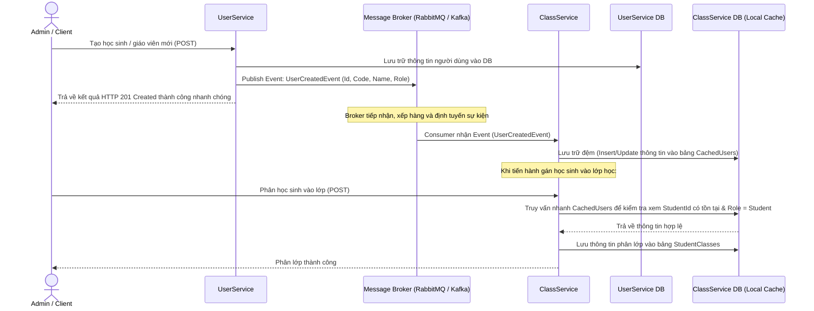

# Hướng Dẫn Kết Nối Microservices: UserService & ClassService qua Event-Driven Architecture (RabbitMQ / Kafka)

Tài liệu này hướng dẫn chi tiết cách thiết lập kết nối bất đồng bộ (Asynchronous Event-Driven) giữa hai microservices `UserService` và `ClassService` sử dụng **MassTransit** kết hợp với **RabbitMQ** (hoặc **Kafka**) làm Message Broker theo đúng luồng sơ đồ thiết kế của bạn.

---

## 1. Kiến Trúc Luồng Sự Kiện (Event-Driven Architecture)

Trong kiến trúc Microservices, mỗi dịch vụ sở hữu cơ sở dữ liệu riêng độc lập để đạt được tính tự trị tối đa. Khi `ClassService` cần thực hiện nghiệp vụ (như phân lớp cho học sinh hoặc gán giáo viên chủ nhiệm), nó cần kiểm tra xem `Id` của học sinh hoặc giáo viên đó có tồn tại thực sự và có đúng vai trò (`Role`) hay không. 

Thay vì gọi HTTP REST API trực tiếp từ `ClassService` sang `UserService` mỗi lần xử lý (gây trễ mạng, tạo liên kết chặt - tight coupling, dễ bị sập hàng loạt nếu `UserService` offline), chúng ta áp dụng mô hình **Event-Driven Collaboration với Local Caching (Lưu trữ đệm)** như sau:



> [!NOTE]
> Bảng đệm `CachedUsers` trong database của `ClassService` chỉ lưu trữ các thông tin cơ bản phục vụ cho việc kiểm tra ràng buộc (như `Id`, `UserCode`, `FullName`, `Role`). Điều này giúp `ClassService` chạy hoàn toàn độc lập, tốc độ truy vấn cực nhanh và không phụ thuộc vào trạng thái hoạt động của `UserService` tại thời điểm đó.

---

## 2. So Sánh & Chọn Lựa Broker: RabbitMQ vs. Kafka

| Tiêu chí | RabbitMQ (Khuyên dùng cho dự án này) | Apache Kafka |
| :--- | :--- | :--- |
| **Mô hình cốt lõi** | Hộp thư (Message Queue). Gửi và xóa tin nhắn sau khi xử lý thành công. | Nhật ký lưu vết (Event Log). Lưu trữ tin nhắn tuần tự lâu dài và có thể phát lại (Replay). |
| **Độ phức tạp** | Thấp. Dễ cài đặt, dễ quản trị, hỗ trợ giao diện quản trị Web đẹp mắt có sẵn. | Cao. Cần cài đặt thêm ZooKeeper hoặc cấu hình chế độ KRaft phức tạp hơn. |
| **Tích hợp .NET** | Hoàn hảo với thư viện MassTransit (chỉ mất vài dòng cấu hình). | Hỗ trợ tốt, nhưng cấu hình MassTransit với Kafka phức tạp hơn do bản chất lưu trữ phân tán. |
| **Ứng dụng tối ưu** | Các sự kiện nghiệp vụ transactional thông thường (Tạo user, gửi email, cập nhật trạng thái). | Xử lý dữ liệu lớn (Big Data ingestion), streaming thời gian thực, lưu trữ nhật ký hệ thống (log aggregation). |

> [!TIP]
> Đối với ứng dụng **UniversityManagement** hiện tại, **RabbitMQ** kết hợp với **MassTransit** là giải pháp tối ưu và nhanh chóng nhất. MassTransit đóng vai trò như một lớp trừu tượng (Abstraction Layer), cho phép bạn chuyển đổi giữa RabbitMQ và Kafka sau này chỉ bằng cách thay đổi vài dòng cấu hình C# mà không cần viết lại logic nghiệp vụ.

---

## 3. Các Bước Triển Khai Chi Tiết

Dưới đây là hướng dẫn cài đặt từng bước cho dự án của bạn (sử dụng các lớp và cấu trúc thực tế trong `UserService` và `ClassService`).

### Bước 1: Khởi Chạy Message Broker bằng Docker

Tạo một file `docker-compose.yml` ở thư mục gốc của giải pháp (`d:\ASP.NET\UniversityManagement\docker-compose.yml`) để quản lý các dịch vụ đi kèm:

```yaml
version: '3.8'

services:
  # RabbitMQ Broker
  rabbitmq:
    image: rabbitmq:3-management-alpine
    container_name: university-rabbitmq
    ports:
      - "5672:5672"     # Cổng giao tiếp chính của các Microservices (AMQP)
      - "15672:15672"   # Cổng giao diện Web UI Quản lý (Giao diện RabbitMQ Management)
    environment:
      RABBITMQ_DEFAULT_USER: guest
      RABBITMQ_DEFAULT_PASS: guest
    volumes:
      - rabbitmq_data:/var/lib/rabbitmq

volumes:
  rabbitmq_data:
```

> [!IMPORTANT]
> Chạy lệnh `docker compose up -d` tại thư mục chứa file trên để khởi động RabbitMQ. Sau đó bạn có thể truy cập http://localhost:15672 với tài khoản `guest` / `guest` để theo dõi các queues.

---

### Bước 2: Định Nghĩa Hợp Đồng Sự Kiện (Shared Events Contract)

Để hai bên hiểu cấu trúc tin nhắn của nhau, chúng ta cần định nghĩa các lớp DTO chung cho Sự kiện.
Tạo thư mục `Shared` hoặc sao chép các định nghĩa này giống nhau ở cả hai project (đảm bảo trùng khớp **Tên Class** và **Tên Namespace** vì MassTransit định tuyến tin nhắn dựa trên Namespace + Class Name của Event).

Tạo thư mục `Events` tại cả 2 service và định nghĩa file `UserEvents.cs`:

```csharp
using System;

namespace Shared.Events;

// Sự kiện phát ra khi thêm mới User
public interface UserCreatedEvent
{
    Guid Id { get; }
    string UserCode { get; }
    string FullName { get; }
    string Role { get; } // "Student", "Teacher", "Admin"
}

// Sự kiện phát ra khi cập nhật thông tin cá nhân hoặc vai trò của User
public interface UserUpdatedEvent
{
    Guid Id { get; }
    string UserCode { get; }
    string FullName { get; }
    string Role { get; }
}

// Sự kiện phát ra khi xóa User khỏi hệ thống
public interface UserDeletedEvent
{
    Guid Id { get; }
}
```

---

### Bước 3: Cấu Hình UserService (Publisher - Phát Sự Kiện)

#### 3.1 Cài đặt NuGet Packages trong [UserService.csproj](file:///d:/ASP.NET/UniversityManagement/UserService/UserService.csproj)
```bash
cd UserService
dotnet add package MassTransit.RabbitMQ
```

#### 3.2 Đăng ký MassTransit trong [Program.cs (UserService)](file:///d:/ASP.NET/UniversityManagement/UserService/Program.cs)
Thêm cấu hình vào Service Collection:

```csharp
using MassTransit;

// Thêm cấu hình MassTransit
builder.Services.AddMassTransit(x =>
{
    x.UsingRabbitMq((context, cfg) =>
    {
        cfg.Host(builder.Configuration["MessageBroker:Host"] ?? "localhost", "/", h =>
        {
            h.Username(builder.Configuration["MessageBroker:Username"] ?? "guest");
            h.Password(builder.Configuration["MessageBroker:Password"] ?? "guest");
        });
    });
});
```

*Cấu hình thêm thông tin kết nối trong `appsettings.json` của `UserService`:*
```json
"MessageBroker": {
  "Host": "localhost",
  "Username": "guest",
  "Password": "guest"
}
```

#### 3.3 Phát Sự Kiện tại [AuthService.cs](file:///d:/ASP.NET/UniversityManagement/UserService/Services/AuthService.cs)
Tiêm `IPublishEndpoint` của MassTransit vào constructor để phát sự kiện lên Broker khi cơ sở dữ liệu thay đổi thành công:

```csharp
using MassTransit;
using Shared.Events;

public class AuthService : IAuthService
{
    private readonly IUserRepository _userRepository;
    private readonly JwtService _jwtService;
    private readonly IPublishEndpoint _publishEndpoint; // Tiêm interface phát tin nhắn

    public AuthService(
        IUserRepository userRepository, 
        JwtService jwtService,
        IPublishEndpoint publishEndpoint) // Nhận từ DI Container
    {
        _userRepository = userRepository;
        _jwtService = jwtService;
        _publishEndpoint = publishEndpoint;
    }

    // 1. Phát Event khi Đăng ký mới
    public async Task<User> RegisterAsync(RegisterRequest request)
    {
        // ... Logic tạo và lưu user vào DB
        var user = await _userRepository.CreateAsync(newUser);

        // Phát sự kiện
        await _publishEndpoint.Publish<UserCreatedEvent>(new
        {
            Id = user.Id,
            UserCode = user.UserCode,
            FullName = user.FullName,
            Role = user.Role.ToString()
        });

        return user;
    }

    // 2. Phát Event khi Admin tạo User mới
    public async Task<User> CreateUserAsync(AdminCreateUserRequest request)
    {
        // ... Logic lưu database
        var user = await _userRepository.CreateAsync(newUser);

        await _publishEndpoint.Publish<UserCreatedEvent>(new
        {
            Id = user.Id,
            UserCode = user.UserCode,
            FullName = user.FullName,
            Role = user.Role.ToString()
        });

        return user;
    }

    // 3. Phát Event khi cập nhật thông tin
    public async Task<User> UpdateUser(Guid id, UpdateUserRequest request)
    {
        // ... Logic cập nhật cơ sở dữ liệu
        var updatedUser = await _userRepository.UpdateAsync(user);

        // Phát sự kiện cập nhật
        await _publishEndpoint.Publish<UserUpdatedEvent>(new
        {
            Id = updatedUser.Id,
            UserCode = updatedUser.UserCode,
            FullName = updatedUser.FullName,
            Role = updatedUser.Role.ToString()
        });

        return updatedUser;
    }

    // 4. Phát Event khi thay đổi Role
    public async Task UpdateRole(Guid userId, UpdateRoleRequest request)
    {
        // ... Logic cập nhật Role
        await _userRepository.UpdateAsync(user);

        await _publishEndpoint.Publish<UserUpdatedEvent>(new
        {
            Id = user.Id,
            UserCode = user.UserCode,
            FullName = user.FullName,
            Role = user.Role.ToString()
        });
    }

    // 5. Phát Event khi Xóa User
    public async Task DeleteUser(Guid id)
    {
        // ... Logic xóa DB
        await _userRepository.DeleteAsync(user);

        // Phát sự kiện xóa
        await _publishEndpoint.Publish<UserDeletedEvent>(new { Id = id });
    }
}
```

---

### Bước 4: Cấu Hình ClassService (Subscriber - Nhận & Lưu Trữ Đệm)

#### 4.1 Cài đặt NuGet Packages trong [ClassService.csproj](file:///d:/ASP.NET/UniversityManagement/ClassService/ClassService.csproj)
```bash
cd ClassService
dotnet add package MassTransit.RabbitMQ
```

#### 4.2 Thiết Kế Bảng Đệm (Local Cache) trong `ClassService`

Tạo một thực thể `CachedUser.cs` trong thư mục [Entities](file:///d:/ASP.NET/UniversityManagement/ClassService/Entities):

```csharp
using System;

namespace ClassService.Entities;

public class CachedUser
{
    public Guid Id { get; set; } // Trùng khớp với Id bên UserService
    public string UserCode { get; set; } = string.Empty;
    public string FullName { get; set; } = string.Empty;
    public string Role { get; set; } = string.Empty; // "Student", "Teacher", "Admin"
    public DateTime SyncedAt { get; set; } = DateTime.UtcNow;
}
```

Cập nhật DbSet trong [ApplicationDbContext.cs](file:///d:/ASP.NET/UniversityManagement/ClassService/Data/ApplicationDbContext.cs):

```csharp
public DbSet<CachedUser> CachedUsers { get; set; }
```

> [!TIP]
> Hãy chạy lệnh CLI để tạo Migration và cập nhật database cho `ClassService`:
> ```bash
> dotnet ef migrations add AddCachedUserTable --project ClassService
> dotnet ef database update --project ClassService
> ```

#### 4.3 Viết Các Consumer Nhận Tin Nhắn Từ Queue

Tạo thư mục `Consumers` trong `ClassService` và định nghĩa file `UserEventsConsumer.cs` chứa tất cả logic xử lý sự kiện:

```csharp
using System.Threading.Tasks;
using ClassService.Data;
using ClassService.Entities;
using MassTransit;
using Microsoft.EntityFrameworkCore;
using Shared.Events;

namespace ClassService.Consumers;

// 1. Consumer tiếp nhận tạo mới User
public class UserCreatedConsumer : IConsumer<UserCreatedEvent>
{
    private readonly ApplicationDbContext _dbContext;

    public UserCreatedConsumer(ApplicationDbContext dbContext)
    {
        _dbContext = dbContext;
    }

    public async Task Consume(ConsumeContext<UserCreatedEvent> context)
    {
        var data = context.Message;

        // Tránh trùng lặp nếu nhận lại tin nhắn cũ
        var existing = await _dbContext.CachedUsers.AnyAsync(u => u.Id == data.Id);
        if (existing) return;

        var cachedUser = new CachedUser
        {
            Id = data.Id,
            UserCode = data.UserCode,
            FullName = data.FullName,
            Role = data.Role,
            SyncedAt = System.DateTime.UtcNow
        };

        _dbContext.CachedUsers.Add(cachedUser);
        await _dbContext.SaveChangesAsync();
    }
}

// 2. Consumer tiếp nhận cập nhật User
public class UserUpdatedConsumer : IConsumer<UserUpdatedEvent>
{
    private readonly ApplicationDbContext _dbContext;

    public UserUpdatedConsumer(ApplicationDbContext dbContext)
    {
        _dbContext = dbContext;
    }

    public async Task Consume(ConsumeContext<UserUpdatedEvent> context)
    {
        var data = context.Message;
        var user = await _dbContext.CachedUsers.FirstOrDefaultAsync(u => u.Id == data.Id);
        
        if (user != null)
        {
            user.UserCode = data.UserCode;
            user.FullName = data.FullName;
            user.Role = data.Role;
            user.SyncedAt = System.DateTime.UtcNow;

            await _dbContext.SaveChangesAsync();
        }
    }
}

// 3. Consumer tiếp nhận xóa User
public class UserDeletedConsumer : IConsumer<UserDeletedEvent>
{
    private readonly ApplicationDbContext _dbContext;

    public UserDeletedConsumer(ApplicationDbContext dbContext)
    {
        _dbContext = dbContext;
    }

    public async Task Consume(ConsumeContext<UserDeletedEvent> context)
    {
        var data = context.Message;
        var user = await _dbContext.CachedUsers.FirstOrDefaultAsync(u => u.Id == data.Id);

        if (user != null)
        {
            _dbContext.CachedUsers.Remove(user);
            await _dbContext.SaveChangesAsync();
        }
    }
}
```

#### 4.4 Đăng Ký Consumers và MassTransit trong [Program.cs (ClassService)](file:///d:/ASP.NET/UniversityManagement/ClassService/Program.cs)

Đăng ký các Consumer của bạn để MassTransit tự động tạo Queue và Bind chúng vào Exchange tương ứng trong RabbitMQ:

```csharp
using MassTransit;
using ClassService.Consumers;

builder.Services.AddMassTransit(x =>
{
    // Đăng ký các Consumers
    x.AddConsumer<UserCreatedConsumer>();
    x.AddConsumer<UserUpdatedConsumer>();
    x.AddConsumer<UserDeletedConsumer>();

    x.UsingRabbitMq((context, cfg) =>
    {
        cfg.Host(builder.Configuration["MessageBroker:Host"] ?? "localhost", "/", h =>
        {
            h.Username(builder.Configuration["MessageBroker:Username"] ?? "guest");
            h.Password(builder.Configuration["MessageBroker:Password"] ?? "guest");
        });

        // Tự động định cấu hình Endpoint (như tên hàng đợi - queue name) dựa trên tên các Consumer đã đăng ký
        cfg.ReceiveEndpoint("class-service-user-events", e =>
        {
            // Thiết lập retry tin nhắn 3 lần nếu có lỗi xảy ra trước khi đưa vào hàng đợi lỗi (error queue)
            e.UseMessageRetry(r => r.Interval(3, System.TimeSpan.FromSeconds(5)));
            
            e.ConfigureConsumer<UserCreatedConsumer>(context);
            e.ConfigureConsumer<UserUpdatedConsumer>(context);
            e.ConfigureConsumer<UserDeletedConsumer>(context);
        });
    });
});
```

*Cấu hình thông tin kết nối trong `appsettings.json` của `ClassService`:*
```json
"MessageBroker": {
  "Host": "localhost",
  "Username": "guest",
  "Password": "guest"
}
```

#### 4.5 Cập Nhật Nghiệp Vụ Tại ClassService để Kiểm Tra Ràng Buộc qua Bảng Đệm

Ví dụ: Cập nhật hàm phân lớp học sinh trong [StudentClassService.cs](file:///d:/ASP.NET/UniversityManagement/ClassService/Services/StudentClassService.cs) để đảm bảo học sinh được gán là tồn tại và có đúng `Role = Student`.

Tiêm `ApplicationDbContext` vào dịch vụ:

```csharp
// Thay đổi constructor
private readonly IStudentClassRepository _studentClassRepository;
private readonly IClassRepository _classRepository;
private readonly ApplicationDbContext _dbContext; // Tiêm DbContext để query bảng đệm CachedUsers

public StudentClassService(
    IStudentClassRepository studentClassRepository,
    IClassRepository classRepository,
    ApplicationDbContext dbContext)
{
    _studentClassRepository = studentClassRepository;
    _classRepository = classRepository;
    _dbContext = dbContext;
}

public async Task<StudentClassResponseDto> AssignStudentAsync(Guid classId, AssignStudentDto dto)
{
    // 1. Kiểm tra Lớp học
    var targetClass = await _classRepository.GetByIdAsync(classId);
    if (targetClass == null)
    {
        throw new KeyNotFoundException($"Không tìm thấy lớp học với ID: {classId}");
    }

    // 2. Truy vấn từ bảng đệm CachedUsers thay vì gọi API mạng sang UserService
    var cachedStudent = await _dbContext.CachedUsers
        .FirstOrDefaultAsync(u => u.Id == dto.StudentId);

    if (cachedStudent == null)
    {
        throw new KeyNotFoundException($"Học sinh với ID {dto.StudentId} không tồn tại trên hệ thống.");
    }

    if (cachedStudent.Role != "Student")
    {
        throw new InvalidOperationException($"Người dùng với ID {dto.StudentId} không có vai trò Học sinh.");
    }

    // 3. Kiểm tra xem học sinh đã có lớp học hiện tại chưa
    var currentAssignment = await _studentClassRepository.GetCurrentStudentClassAsync(dto.StudentId);
    if (currentAssignment != null)
    {
        throw new InvalidOperationException("Học sinh đã có lớp học hiện tại.");
    }

    // 4. Lưu phân lớp mới
    var studentClass = new StudentClass
    {
        Id = Guid.NewGuid(),
        StudentId = dto.StudentId,
        ClassId = classId,
        SchoolYear = targetClass.SchoolYear,
        AssignedDate = DateTime.UtcNow,
        IsCurrent = true
    };

    await _studentClassRepository.AddAsync(studentClass);
    await _studentClassRepository.SaveChangesAsync();

    return MapToResponseDto(studentClass);
}
```

> [!TIP]
> Bạn áp dụng logic kiểm tra tương tự từ bảng `CachedUsers` đối với:
> - **GVCN** (`Role == "Teacher"`) trong `HomeroomAssignmentService.cs` khi phân công chủ nhiệm.
> - **Giáo viên giảng dạy** (`Role == "Teacher"`) trong `TeachingAssignmentService.cs` khi phân công giảng dạy môn học.

---

## 4. Tùy Chọn 2: Sử Dụng Apache Kafka

Nếu bạn muốn cấu hình Kafka thay cho RabbitMQ:

### 4.1 Khởi chạy Kafka qua Docker Compose
Thêm container cho Kafka & Zookeeper:

```yaml
  zookeeper:
    image: confluentinc/cp-zookeeper:7.3.0
    container_name: university-zookeeper
    environment:
      ZOOKEEPER_CLIENT_PORT: 2181
      ZOOKEEPER_TICK_TIME: 2000

  kafka:
    image: confluentinc/cp-kafka:7.3.0
    container_name: university-kafka
    ports:
      - "9092:9092"
    depends_on:
      - zookeeper
    environment:
      KAFKA_BROKER_ID: 1
      KAFKA_ZOOKEEPER_CONNECT: zookeeper:2181
      KAFKA_ADVERTISED_LISTENERS: PLAINTEXT://localhost:9092,PLAINTEXT_INTERNAL://kafka:29092
      KAFKA_LISTENER_SECURITY_PROTOCOL_MAP: PLAINTEXT:PLAINTEXT,PLAINTEXT_INTERNAL:PLAINTEXT
      KAFKA_INTER_BROKER_LISTENER_NAME: PLAINTEXT_INTERNAL
      KAFKA_OFFSETS_TOPIC_REPLICATION_FACTOR: 1
```

### 4.2 Cấu hình MassTransit kết hợp Kafka trong .NET
Cài đặt gói NuGet:
```bash
dotnet add package MassTransit.Kafka
```

Sau đó đăng ký MassTransit cấu hình Producer và Consumer bằng cách sử dụng `x.UsingKafka()` thay thế cho `x.UsingRabbitMq()`. Vì Kafka dựa trên khái niệm Topics thay vì Exchange/Queue, bạn sẽ cần cấu hình rõ tên Topic cho mỗi sự kiện (ví dụ: `user-created-topic`).

---

## 5. Các Mẹo Thiết Kế Hệ Thống Thực Tế Hữu Ích

1. **Outbox Pattern**: Trong một hệ thống tối ưu, nếu database của `UserService` lưu thành công nhưng mạng chập chờn khiến không thể gửi tin nhắn lên RabbitMQ, dữ liệu sẽ bị lệch. Outbox Pattern lưu Event vào một bảng phụ trong DB của `UserService` trước trong cùng một Transaction, sau đó một tác vụ chạy nền (Background Worker) sẽ đọc bảng này và gửi tin nhắn lên RabbitMQ để đảm bảo tin nhắn chắc chắn được phát đi thành công (At-Least-Once Delivery).
2. **Đồng bộ hóa dữ liệu ban đầu (Initial Seeding/Migration Sync)**: Khi bạn deploy `ClassService` lên một cơ sở dữ liệu mới hoàn toàn trống rỗng trong khi `UserService` đã chạy lâu năm, bạn cần chuẩn bị một script / API quản trị để "Export/Import" hoặc "Re-sync" toàn bộ danh sách User hiện tại từ `UserService` sang bảng đệm `CachedUsers` của `ClassService` ở lần chạy đầu tiên.
3. **Idempotent Consumer**: Đảm bảo Consumer của bạn không bị lỗi hoặc xử lý sai lệch nếu vì lý do mạng lỗi mà RabbitMQ gửi trùng 1 Event tạo User nhiều lần. Hãy luôn kiểm tra sự tồn tại của Id (`AnyAsync(u => u.Id == data.Id)`) trước khi ghi đè hoặc insert mới.
