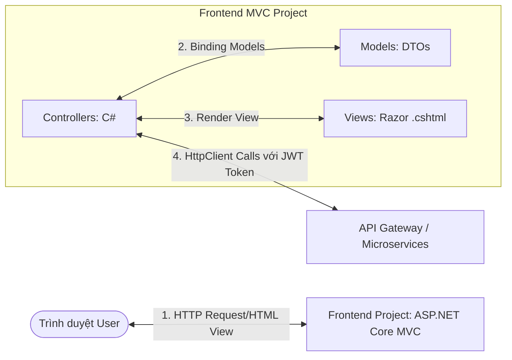

# Hướng Dẫn Kiến Trúc & Thiết Kế Giao Diện Frontend (ASP.NET Core MVC)

Tài liệu này phân tích chi tiết cách xây dựng giao diện người dùng (Frontend) tương thích với hệ thống Microservices hiện tại (`UserService`, `ClassService`, `SubjectService`, `ScoreService`) sử dụng mô hình **ASP.NET Core MVC (C# / Razor Views)** và phác thảo chi tiết giao diện (UI/UX) của các đối tượng sử dụng.

---

## 1. Lựa Chọn Ngôn Ngữ & Mô Hình Giao Diện

Để tuân thủ đúng mô hình **MVC (Model-View-Controller)** truyền thống trong hệ sinh thái .NET, chúng ta sẽ xây dựng một dự án Frontend độc lập bằng **ASP.NET Core MVC**:
* **Language:** **C#** (Backend của FE) + **Razor HTML/CSS/JS** (giao diện `.cshtml`).
* **Mô hình vận hành:** dự án FE MVC này đóng vai trò là một **Web Client** tiêu thụ các API từ các dịch vụ Microservices.

### Sơ đồ hoạt động của mô hình MVC Client:



### Tại sao lại làm như vậy? (Lợi ích thiết kế)
1. **Đúng mô hình MVC:** Controller (C#) xử lý điều hướng, Model (C# DTOs) lưu trữ cấu trúc dữ liệu, và View (Razor) kết xuất mã HTML tĩnh gửi về trình duyệt.
2. **Bảo mật JWT tốt hơn:** MVC Client sẽ lưu trữ **JWT Token** trong **Secure HTTP-Only Cookie** ở trình duyệt thay vì `localStorage` (tránh được tấn công XSS đánh cắp token). Khi Controller của FE gọi sang các Microservices, nó sẽ đọc token từ Cookie này và đính kèm vào Header của `HttpClient`.
3. **SEO & Performance:** Server-Side Rendering (SSR) giúp trình duyệt hiển thị giao diện cực nhanh và thân thiện với SEO.

---

## 2. Giao Diện Người Dùng (UI/UX Wireframes)

Hệ thống phục vụ 3 nhóm đối tượng: **Admin**, **Giáo viên (Teacher)**, và **Học sinh (Student)**. Dưới đây là phác thảo giao diện trực quan cho từng phân hệ:

---

### 2.1. Giao Diện Đăng Nhập (Chung)
Trang đăng nhập tối giản và hiện đại. Hệ thống tự động chuyển hướng người dùng đến Dashboard tương ứng dựa trên `Role` lưu trong JWT Token sau khi đăng nhập thành công.

```text
+-----------------------------------------------------------------+
|                                                                 |
|                      UNIVERSITY MANAGEMENT                      |
|                                                                 |
|                     +-----------------------+                   |
|                     |        LOG IN         |                   |
|                     |                       |                   |
|                     |  Email:               |                   |
|                     |  [ admin@school.edu ] |                   |
|                     |                       |                   |
|                     |  Mật khẩu:            |                   |
|                     |  [ ************     ] |                   |
|                     |                       |                   |
|                     |     [ ĐĂNG NHẬP ]     |                   |
|                     +-----------------------+                   |
|                                                                 |
+-----------------------------------------------------------------+
```

---

### 2.2. Giao Diện Admin (Quản trị viên)
Admin có thanh điều hướng (Sidebar) để quản lý Người dùng (Users), Lớp học (Classes) và Môn học (Subjects).

#### Layout Quản Lý Học Sinh / Giáo Viên (Admin Portal):
```text
+------------------------------------------------------------------------------------+
|  UNIVERSITY ADMIN  |  Xin chào: Nguyễn Văn A (Admin) |  [ Đăng xuất ]              |
+------------------------------------------------------------------------------------+
| [Sidebar]          |  QUẢN LÝ NGƯỜI DÙNG                                            |
|                    |                                                                |
| > Người dùng       |  [ + Thêm Người Dùng Mới ]  |  Tìm kiếm: [ HS001           ]   |
| > Lớp học          |  +----------------------------------------------------------+  |
| > Môn học          |  | Mã Số  | Họ và Tên    | Vai Trò | Lớp     | Hành Động    |  |
|                    |  +--------+--------------+---------+---------+--------------+  |
|                    |  | TEA003 | Trần Thị Lan | Teacher | N/A     | [Sửa] [Xóa]  |  |
|                    |  | HS001  | Nguyễn Văn B | Student | 10A1    | [Sửa] [Xóa]  |  |
|                    |  +--------+--------------+---------+---------+--------------+  |
|                    |                                                                |
+------------------------------------------------------------------------------------+
```

#### Layout Quản Lý Phân Công Lớp Học:
```text
+------------------------------------------------------------------------------------+
|  UNIVERSITY ADMIN  |  Xin chào: Nguyễn Văn A (Admin) |  [ Đăng xuất ]              |
+------------------------------------------------------------------------------------+
| [Sidebar]          |  PHÂN LỚP & PHÂN CÔNG GIÁO VIÊN                                |
|                    |                                                                |
| > Người dùng       |  Chọn Lớp: [ Lớp 10A1 (Khối 10)  v ]                           |
| v Lớp học          |  Giáo viên chủ nhiệm: [ Trần Thị Lan (Vật Lý)    ]  [Lưu]      |
|   - Xem Lớp        |                                                                |
|   - Phân Lớp       |  Danh sách học sinh trong lớp:                                 |
| > Môn học          |  +----------------------------------------------------------+  |
|                    |  | STT | Mã Học Sinh | Họ và Tên    | Giới Tính | Hành Động |  |
|                    |  +-----+-------------+--------------+-----------+-----------+  |
|                    |  | 1   | HS001       | Nguyễn Văn B | Nam       | [Xóa khỏi]|  |
|                    |  +-----+-------------+--------------+-----------+-----------+  |
|                    |  [ + Thêm học sinh vào lớp ]                                   |
+------------------------------------------------------------------------------------+
```

---

### 2.3. Giao Diện Giáo Viên (Teacher Portal)
Giáo viên đăng nhập sẽ thấy danh sách các lớp học được phân công giảng dạy. Họ có quyền nhập điểm và xem thời khóa biểu dạy.

#### Layout Nhập / Sửa Điểm Học Sinh:
```text
+------------------------------------------------------------------------------------+
|  TEACHER PORTAL   |  Xin chào: Trần Thị Lan (Teacher) |  [ Đăng xuất ]             |
+------------------------------------------------------------------------------------+
| [Sidebar]          |  NHẬP ĐIỂM SỐ - LỚP 10A1                                       |
|                    |                                                                |
| > Lớp dạy của tôi  |  Môn học: [ Vật Lý 10 v ]  Học kỳ: [ Kỳ 1 v ]  Năm: [ 2025-2026] |
| > Thời khóa biểu   |                                                                |
|                    |  +----------------------------------------------------------+  |
|                    |  | Mã HS | Họ Tên       | Miệng | 15 Phút | 1 Tiết | Học Kỳ |  |
|                    |  +-------+--------------+-------+---------+--------+--------+  |
|                    |  | HS001 | Nguyễn Văn B | [8.5] | [ 7.0 ] | [8.0 ] | [ 9.0] |  |
|                    |  | HS002 | Trần Văn C   | [9.0] | [ 8.5 ] | [7.5 ] | [ 8.0] |  |
|                    |  +-------+--------------+-------+---------+--------+--------+  |
|                    |                                                                |
|                    |  [ LƯU BẢNG ĐIỂM ]                                             |
+------------------------------------------------------------------------------------+
```

---

### 2.4. Giao Diện Học Sinh (Student Portal)
Học sinh đăng nhập chỉ có quyền xem thông tin cá nhân, thời khóa biểu lớp mình và xem bảng điểm (học bạ) trực tuyến của mình.
#### Layout Xem Bảng Điểm Cá Nhân:
```text
+------------------------------------------------------------------------------------+
|  STUDENT PORTAL   |  Xin chào: Nguyễn Văn B (Học sinh lớp 10A1) |  [ Đăng xuất ]    |
+------------------------------------------------------------------------------------+
| [Sidebar]          |  BẢNG ĐIỂM HỌC TẬP CỦA TÔI                                     |
|                    |                                                                |
| > Lý lịch cá nhân  |  Chọn năm học: [ Năm học 2025-2026 v ]                         |
| > Thời khóa biểu   |                                                                |
| v Bảng điểm        |  Học kỳ 1:                                                     |
|                    |  +----------------------------------------------------------+  |
|                    |  | Môn Học  | Điểm Miệng | 15 Phút | 1 Tiết | Thi HK | TBM    |  |
|                    |  +----------+------------+---------+--------+--------+--------+  |
|                    |  | Toán học | 9.0        | 8.0     | 8.5    | 8.0    | 8.2    |  |
|                    |  | Vật lý   | 8.5        | 7.0     | 8.0    | 9.0    | 8.1    |  |
|                    |  +----------+------------+---------+--------+--------+--------+  |
|                    |                                                                |
+------------------------------------------------------------------------------------+
```

---

## 3. Quy Trình Hiện Thực Dự Án Frontend MVC

Dưới đây là các bước tạo dựng cấu trúc code của dự án MVC Client kết nối đến cụm Microservices:

### Bước 1: Khởi Tạo Dự Án Frontend MVC
Mở Terminal tại thư mục gốc `UniversityManagement` và khởi tạo project:
```bash
dotnet new mvc -n FrontendMVC
dotnet sln UniversityManagement.sln add FrontendMVC/FrontendMVC.csproj
```

### Bước 2: Thiết Lập Cấu Hình Connection URL (`appsettings.json`)
Cấu hình các Endpoint API trỏ đến các microservices tương ứng hoặc qua API Gateway:
```json
{
  "Microservices": {
    "UserService": "http://localhost:5156/api",
    "ClassService": "http://localhost:5124/api",
    "SubjectService": "http://localhost:5187/api",
    "ScoreService": "http://localhost:5221/api"
  },
  "Logging": {
    "LogLevel": {
      "Default": "Information",
      "Microsoft.AspNetCore": "Warning"
    }
  }
}
```

### Bước 3: Triển khai C# HTTP Handler Tự Động Gắn JWT Token
Tạo một lớp trung gian kế thừa từ `DelegatingHandler` để tự động đọc JWT Token từ Cookie và thêm vào Header của `HttpClient` trước khi gọi sang các API Backend:

```csharp
// File: FrontendMVC/Infrastructure/BearerTokenHandler.cs
using System.Net.Http;
using System.Net.Http.Headers;
using System.Threading;
using System.Threading.Tasks;
using Microsoft.AspNetCore.Http;

namespace FrontendMVC.Infrastructure;

public class BearerTokenHandler : DelegatingHandler
{
    private readonly IHttpContextAccessor _httpContextAccessor;

    public BearerTokenHandler(IHttpContextAccessor httpContextAccessor)
    {
        _httpContextAccessor = httpContextAccessor;
    }

    protected override async Task<HttpResponseMessage> SendAsync(HttpRequestMessage request, CancellationToken cancellationToken)
    {
        // Đọc JWT Token từ Cookie được mã hóa/bảo mật
        var token = _httpContextAccessor.HttpContext?.Request.Cookies["jwt_token"];

        if (!string.IsNullOrEmpty(token))
        {
            request.Headers.Authorization = new AuthenticationHeaderValue("Bearer", token);
        }

        return await base.SendAsync(request, cancellationToken);
    }
}
```

### Bước 4: Đăng ký HTTP Clients trong `Program.cs` của Frontend
```csharp
// File: FrontendMVC/Program.cs
using FrontendMVC.Infrastructure;

var builder = WebApplication.CreateBuilder(args);

builder.Services.AddControllersWithViews();
builder.Services.AddHttpContextAccessor();
builder.Services.AddTransient<BearerTokenHandler>();

// Đăng ký HttpClient có gắn Token Handler cho từng service
builder.Services.AddHttpClient("UserService", client =>
{
    client.BaseAddress = new Uri(builder.Configuration["Microservices:UserService"]!);
}).AddHttpMessageHandler<BearerTokenHandler>();

builder.Services.AddHttpClient("ScoreService", client =>
{
    client.BaseAddress = new Uri(builder.Configuration["Microservices:ScoreService"]!);
}).AddHttpMessageHandler<BearerTokenHandler>();

// Các cấu hình khác ...
var app = builder.Build();
app.UseStaticFiles();
app.UseRouting();
app.UseAuthentication();
app.UseAuthorization();

app.MapControllerRoute(
    name: "default",
    pattern: "{controller=Auth}/{action=Login}/{id?}");

app.Run();
```

### Bước 5: Viết Controller Xử Lý Nghiệp Vụ (Gọi API và Đẩy Dữ Liệu Lên View)
Ví dụ viết Controller cho giao diện xem điểm học sinh:

```csharp
// File: FrontendMVC/Controllers/ScoreController.cs
using System;
using System.Collections.Generic;
using System.Net.Http;
using System.Net.Http.Json;
using System.Threading.Tasks;
using Microsoft.AspNetCore.Mvc;
using FrontendMVC.Models; // Chứa các DTOs đại diện cho Model nhận từ API

namespace FrontendMVC.Controllers;

public class ScoreController : Controller
{
    private readonly IHttpClientFactory _clientFactory;

    public ScoreController(IHttpClientFactory clientFactory)
    {
        _clientFactory = clientFactory;
    }

    // GET: /score/student/{id}
    public async Task<IActionResult> StudentTranscript(Guid id)
    {
        var client = _clientFactory.CreateClient("ScoreService");
        
        try
        {
            // Gọi bất đồng bộ sang API ScoreService
            var response = await client.GetAsync($"scores/student/{id}");

            if (response.IsSuccessStatusCode)
            {
                var scores = await response.Content.ReadFromJsonAsync<IEnumerable<ScoreResponseViewModel>>();
                return View(scores); // Đẩy dữ liệu Model sang Razor View kết xuất
            }
            else if (response.StatusCode == System.Net.HttpStatusCode.Forbidden)
            {
                return RedirectToAction("AccessDenied", "Auth");
            }
        }
        except (Exception ex)
        {
            ViewBag.ErrorMessage = "Không thể kết nối đến máy chủ điểm số.";
        }

        return View(new List<ScoreResponseViewModel>());
    }
}
```

### Bước 6: Xây dựng Razor View (.cshtml) Hiển Thị Bảng Điểm
```html
@* File: FrontendMVC/Views/Score/StudentTranscript.cshtml *@
@model IEnumerable<FrontendMVC.Models.ScoreResponseViewModel>

@{
    ViewData["Title"] = "Bảng Điểm Học Tập";
    Layout = "_Layout";
}

<div class="container mt-4">
    <h2>Bảng Điểm Học Tập Cá Nhân</h2>
    <p>Học sinh: <strong>@(Model.FirstOrDefault()?.StudentName ?? "N/A")</strong> - Mã số: @(Model.FirstOrDefault()?.StudentCode ?? "N/A")</p>

    <table class="table table-bordered table-striped mt-3">
        <thead class="table-dark">
            <tr>
                <th>Môn Học</th>
                <th>Phân Loại Điểm</th>
                <th>Điểm Số</th>
                <th>Học Kỳ</th>
                <th>Năm Học</th>
            </tr>
        </thead>
        <tbody>
            @if (!Model.Any())
            {
                <tr>
                    <td colspan="5" class="text-center text-muted">Chưa có dữ liệu điểm số.</td>
                </tr>
            }
            else
            {
                @foreach (var item in Model)
                {
                    <tr>
                        <td>@item.SubjectName (@item.SubjectCode)</td>
                        <td>@item.Type</td>
                        <td class="fw-bold">@item.ScoreValue</td>
                        <td>Học kỳ @item.Semester</td>
                        <td>@item.SchoolYear</td>
                    </tr>
                }
            }
        </tbody>
    </table>
</div>
```
