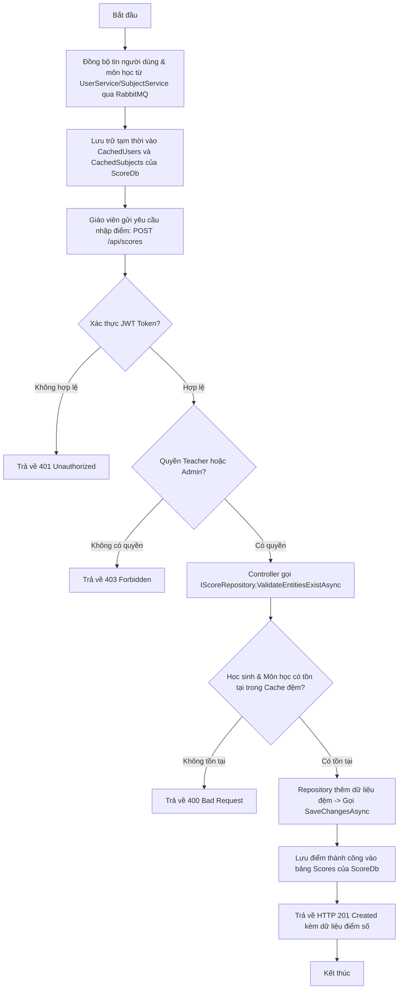

# Hướng Dẫn Chi Tiết Xây Dựng ScoreService (Quản Lý Điểm Số & Tích Hợp RabbitMQ)

Tài liệu này hướng dẫn chi tiết từ lý thuyết thiết kế, cấu trúc thư mục, code mẫu hoàn chỉnh và lý do tại sao lại thiết kế như vậy đối với microservice **ScoreService** trong hệ thống **UniversityManagement**.

---

## 1. Kiến Trúc và Lý Do Thiết Kế

`ScoreService` là dịch vụ độc lập chịu trách nhiệm quản lý điểm số của học sinh theo từng môn học, khối lớp, học kỳ và năm học.

### Tại sao ScoreService cần Database riêng (`ScoreDb`)?
* **Tính độc lập dữ liệu (Data Autonomy):** Điểm số là dữ liệu có tần suất đọc/ghi cực kỳ cao và nhạy cảm. Việc tách biệt database giúp tránh hiện tượng thắt nút cổ chai (bottleneck) ở các database chính và giúp dễ dàng tối ưu hóa chỉ mục (indexes) phục vụ việc tính toán điểm trung bình.
* **Tự trị hoạt động:** Nếu dịch vụ quản lý lớp học hoặc môn học tạm thời ngoại tuyến, giáo viên vẫn có thể tiếp tục nhập điểm bình thường.

### Tại sao không gọi REST API trực tiếp từ ScoreService sang các service khác?
Khi một giáo viên nhập điểm cho một học sinh:
1. Hệ thống cần kiểm tra xem `StudentId` có tồn tại và đúng vai trò `Student` hay không.
2. Hệ thống cần kiểm tra xem `TeacherId` có tồn tại và đúng vai trò `Teacher` hay không.
3. Hệ thống cần kiểm tra xem `SubjectId` có tồn tại hay không.

Nếu gọi REST API trực tiếp sang `UserService` và `SubjectService` mỗi lần nhập điểm:
* **Độ trễ cao (High Latency):** Làm chậm tốc độ phản hồi của API nhập điểm (giáo viên nhập một bảng điểm 40 học sinh sẽ phải gọi 80 lượt API sang các service khác).
* **Rủi ro sập dây chuyền (Cascading Failure):** Chỉ cần `UserService` gặp sự cố, luồng nhập điểm sẽ bị gián đoạn hoàn toàn.
* **Giải pháp:** Sử dụng **Event-Driven Architecture với Local Caching (Lưu trữ đệm)** qua **RabbitMQ**. `ScoreService` sẽ lắng nghe các sự kiện thay đổi dữ liệu từ `UserService` và `SubjectService` để đồng bộ vào hai bảng đệm local: `CachedUsers` và `CachedSubjects`. Khi nhập điểm, việc kiểm tra ràng buộc chỉ diễn ra nội bộ trong `ScoreDb` với tốc độ cực nhanh.

---

## 2. Cấu Trúc Thư Mục Dự Án

Dự án `ScoreService` được tổ chức theo chuẩn cấu trúc Microservice sạch sẽ:

```text
ScoreService/
│
├── Properties/
│   └── launchSettings.json    # Cấu hình cổng chạy (Port 5221)
│
├── Entities/                  # Thực thể cơ sở dữ liệu (Database Models)
│   ├── Score.cs               # Thực thể Điểm số chính
│   ├── CachedUser.cs          # Dữ liệu đệm học sinh & giáo viên (từ UserService)
│   └── CachedSubject.cs       # Dữ liệu đệm môn học (từ SubjectService)
│
├── Data/                      # Tầng cấu hình kết nối DB (EF Core)
│   ├── ScoreDbContext.cs      # Lớp DbContext quản lý kết nối database
│   └── DbInitializer.cs       # Nạp dữ liệu ban đầu nếu cần thiết
│
├── Repositories/              # Tầng truy xuất dữ liệu (Data Access Layer)
│   ├── IScoreRepository.cs    # Interface định nghĩa các hàm CRUD điểm số
│   └── ScoreRepository.cs     # Triển khai các hàm CRUD điểm số với EF Core
│
├── Services/                  # Tầng xử lý logic nghiệp vụ bổ sung (nếu có)
│
├── DTOs/                      # Đối tượng truyền tải dữ liệu (Data Transfer Objects)
│   ├── CreateScoreRequest.cs
│   ├── UpdateScoreRequest.cs
│   └── ScoreResponse.cs
│
├── Events/                    # Các sự kiện nhận từ các service khác qua RabbitMQ
│   ├── UserEvents.cs          # Hợp đồng sự kiện người dùng
│   └── SubjectEvents.cs       # Hợp đồng sự kiện môn học
│
├── Consumers/                 # Bộ lắng nghe sự kiện từ RabbitMQ (MassTransit)
│   ├── UserEventsConsumer.cs  # Đồng bộ thông tin người dùng vào CachedUsers
│   └── SubjectEventsConsumer.cs # Đồng bộ thông tin môn học vào CachedSubjects
│
├── Controllers/               # Tầng định tuyến API Endpoints
│   └── ScoreController.cs     # API CRUD nhập/sửa/xóa & tra cứu điểm số
│
├── Middleware/                # Các bộ lọc/xử lý trung gian
│   └── ExceptionMiddleware.cs # Xử lý lỗi toàn cục (Global Exception Handler)
│
├── Program.cs                 # File cấu hình khởi chạy ứng dụng chính
├── appsettings.json           # File chứa cấu hình ConnectionString & JWT & RabbitMQ
└── ScoreService.csproj        # File cấu hình thư viện và build dự án
```

---

## 3. Chi Tiết Code & Giải Thích Từng File

### 3.1. Cấu hình dự án (`ScoreService.csproj`)

```xml
<Project Sdk="Microsoft.NET.Sdk.Web">

  <PropertyGroup>
    <TargetFramework>net9.0</TargetFramework>
    <Nullable>enable</Nullable>
    <ImplicitUsings>enable</ImplicitUsings>
  </PropertyGroup>

  <ItemGroup>
    <PackageReference Include="MassTransit.RabbitMQ" Version="8.3.6" />
    <PackageReference Include="Microsoft.AspNetCore.Authentication.JwtBearer" Version="9.0.9" />
    <PackageReference Include="Microsoft.AspNetCore.OpenApi" Version="9.0.9" />
    <PackageReference Include="Microsoft.EntityFrameworkCore" Version="9.0.9" />
    <PackageReference Include="Microsoft.EntityFrameworkCore.Design" Version="9.0.9">
      <IncludeAssets>runtime; build; native; contentfiles; analyzers; buildtransitive</IncludeAssets>
      <PrivateAssets>all</PrivateAssets>
    </PackageReference>
    <PackageReference Include="Npgsql.EntityFrameworkCore.PostgreSQL" Version="9.0.4" />
    <PackageReference Include="Scalar.AspNetCore" Version="2.16.3" />
  </ItemGroup>

</Project>
```

---

### 3.2. Cấu hình môi trường (`appsettings.json`)

```json
{
  "ConnectionStrings": {
    "DefaultConnection": "Host=localhost;Port=5432;Database=ScoreDb;Username=postgres;Password=123456"
  },
  "Jwt": {
    "Key": "SuperSecretKeyForJwtAuthenticationThatIsLongEnoughToAvoidErrors123456!",
    "Issuer": "UserService",
    "Audience": "UniversityManagement"
  },
  "MessageBroker": {
    "Host": "localhost",
    "Username": "guest",
    "Password": "guest"
  },
  "Logging": {
    "LogLevel": {
      "Default": "Information",
      "Microsoft.AspNetCore": "Warning"
    }
  },
  "AllowedHosts": "*"
}
```

---

### 3.3. Thực thể dữ liệu (`Entities/`)

#### File: `Entities/Score.cs`
Quản lý các thông tin điểm số chính thức.
```csharp
using System;

namespace ScoreService.Entities;

public enum ScoreType
{
    Oral = 1,          // Điểm miệng
    FifteenMinutes = 2, // Điểm 15 phút
    OnePeriod = 3,      // Điểm 1 tiết
    MidTerm = 4,        // Điểm giữa kỳ
    Final = 5           // Điểm cuối kỳ
}

public class Score
{
    public Guid Id { get; set; }
    public Guid StudentId { get; set; } // Khóa ngoại ảo đến bảng CachedUsers
    public Guid SubjectId { get; set; } // Khóa ngoại ảo đến bảng CachedSubjects
    public Guid TeacherId { get; set; } // Khóa ngoại ảo đến bảng CachedUsers (người nhập điểm)
    
    public decimal ScoreValue { get; set; } // Điểm số (0.0 -> 10.0)
    public ScoreType Type { get; set; } // Loại điểm (Miệng, 15p, 1 tiết, Giữa kỳ, Cuối kỳ)
    public int Semester { get; set; } // Học kỳ (1 hoặc 2)
    public string SchoolYear { get; set; } = string.Empty; // Ví dụ: "2025-2026"
    
    public DateTime CreatedAt { get; set; } = DateTime.UtcNow;
    public DateTime UpdatedAt { get; set; } = DateTime.UtcNow;

    // Navigation properties đệm
    public CachedUser? Student { get; set; }
    public CachedSubject? Subject { get; set; }
}
```

#### File: `Entities/CachedUser.cs`
Lưu đệm thông tin người dùng được đồng bộ từ `UserService`.
```csharp
using System;

namespace ScoreService.Entities;

public class CachedUser
{
    public Guid Id { get; set; } // Trùng khớp ID từ UserService
    public string UserCode { get; set; } = string.Empty;
    public string FullName { get; set; } = string.Empty;
    public string Role { get; set; } = string.Empty; // "Student" hoặc "Teacher"
    public DateTime LastUpdated { get; set; } = DateTime.UtcNow;
}
```

#### File: `Entities/CachedSubject.cs`
Lưu đệm thông tin môn học được đồng bộ từ `SubjectService`.
```csharp
using System;

namespace ScoreService.Entities;

public class CachedSubject
{
    public Guid Id { get; set; } // Trùng khớp ID từ SubjectService
    public string Code { get; set; } = string.Empty;
    public string Name { get; set; } = string.Empty;
    public int GradeLevel { get; set; }
    public DateTime LastUpdated { get; set; } = DateTime.UtcNow;
}
```

---

### 3.4. Cấu hình Database (`Data/ScoreDbContext.cs`)

Cấu hình các bảng và mối liên kết khóa ngoại nội bộ trong dịch vụ `ScoreService`.
```csharp
using Microsoft.EntityFrameworkCore;
using ScoreService.Entities;

namespace ScoreService.Data;

public class ScoreDbContext : DbContext
{
    public ScoreDbContext(DbContextOptions<ScoreDbContext> options) : base(options) { }

    public DbSet<Score> Scores => Set<Score>();
    public DbSet<CachedUser> CachedUsers => Set<CachedUser>();
    public DbSet<CachedSubject> CachedSubjects => Set<CachedSubject>();

    protected override void OnModelCreating(ModelBuilder modelBuilder)
    {
        base.OnModelCreating(modelBuilder);

        // Khai báo quan hệ khóa ngoại giữa Score và CachedUser (Học sinh)
        modelBuilder.Entity<Score>()
            .HasOne(s => s.Student)
            .WithMany()
            .HasForeignKey(s => s.StudentId)
            .OnDelete(DeleteBehavior.Cascade);

        // Khai báo quan hệ khóa ngoại giữa Score và CachedSubject
        modelBuilder.Entity<Score>()
            .HasOne(s => s.Subject)
            .WithMany()
            .HasForeignKey(s => s.SubjectId)
            .OnDelete(DeleteBehavior.Cascade);

        // Ràng buộc khoảng điểm từ 0.0 đến 10.0
        modelBuilder.Entity<Score>()
            .ToTable(t => t.HasCheckConstraint("CK_Score_Value", "\"ScoreValue\" >= 0.0 AND \"ScoreValue\" <= 10.0"));
    }
}
```

---

### 3.5. Đối tượng truyền tải dữ liệu (`DTOs/`)

#### File: `DTOs/ScoreRequests.cs`
```csharp
using System;
using System.ComponentModel.DataAnnotations;
using ScoreService.Entities;

namespace ScoreService.DTOs;

public class CreateScoreRequest
{
    [Required(ErrorMessage = "Mã học sinh là bắt buộc")]
    public Guid StudentId { get; set; }

    [Required(ErrorMessage = "Mã môn học là bắt buộc")]
    public Guid SubjectId { get; set; }

    [Range(0.0, 10.0, ErrorMessage = "Điểm số phải từ 0.0 đến 10.0")]
    public decimal ScoreValue { get; set; }

    [Required(ErrorMessage = "Loại điểm là bắt buộc")]
    public ScoreType Type { get; set; }

    [Range(1, 2, ErrorMessage = "Học kỳ chỉ có thể là 1 hoặc 2")]
    public int Semester { get; set; }

    [Required(ErrorMessage = "Năm học là bắt buộc")]
    [RegularExpression(@"^\d{4}-\d{4}$", ErrorMessage = "Định dạng năm học phải là YYYY-YYYY (Ví dụ: 2025-2026)")]
    public string SchoolYear { get; set; } = string.Empty;
}

public class UpdateScoreRequest
{
    [Range(0.0, 10.0, ErrorMessage = "Điểm số phải từ 0.0 đến 10.0")]
    public decimal ScoreValue { get; set; }
}

public class ScoreResponse
{
    public Guid Id { get; set; }
    public Guid StudentId { get; set; }
    public string StudentName { get; set; } = string.Empty;
    public string StudentCode { get; set; } = string.Empty;
    
    public Guid SubjectId { get; set; }
    public string SubjectName { get; set; } = string.Empty;
    public string SubjectCode { get; set; } = string.Empty;
    
    public Guid TeacherId { get; set; }
    public decimal ScoreValue { get; set; }
    public string Type { get; set; } = string.Empty;
    public int Semester { get; set; }
    public string SchoolYear { get; set; } = string.Empty;
    public DateTime CreatedAt { get; set; }
}
```

---

### 3.6. Tầng Repository (`Repositories/`)

#### Interface: `Repositories/IScoreRepository.cs`
```csharp
using System;
using System.Collections.Generic;
using System.Threading.Tasks;
using ScoreService.Entities;

namespace ScoreService.Repositories;

public interface IScoreRepository
{
    Task<IEnumerable<Score>> GetScoresByStudentAsync(Guid studentId);
    Task<IEnumerable<Score>> GetScoresByClassAndSubjectAsync(List<Guid> studentIds, Guid subjectId, string schoolYear, int semester);
    Task<Score?> GetByIdAsync(Guid id);
    Task<Score> CreateAsync(Score score);
    Task UpdateAsync(Score score);
    Task DeleteAsync(Score score);
    Task<bool> ValidateEntitiesExistAsync(Guid studentId, Guid subjectId, Guid teacherId);
    Task SaveChangesAsync();
}
```

#### Triển khai thực tế: `Repositories/ScoreRepository.cs`
```csharp
using System;
using System.Collections.Generic;
using System.Linq;
using System.Threading.Tasks;
using Microsoft.EntityFrameworkCore;
using ScoreService.Data;
using ScoreService.Entities;

namespace ScoreService.Repositories;

public class ScoreRepository : IScoreRepository
{
    private readonly ScoreDbContext _db;

    public ScoreRepository(ScoreDbContext db)
    {
        _db = db;
    }

    public async Task<IEnumerable<Score>> GetScoresByStudentAsync(Guid studentId)
    {
        return await _db.Scores
            .Include(s => s.Student)
            .Include(s => s.Subject)
            .Where(s => s.StudentId == studentId)
            .ToListAsync();
    }

    public async Task<IEnumerable<Score>> GetScoresByClassAndSubjectAsync(List<Guid> studentIds, Guid subjectId, string schoolYear, int semester)
    {
        return await _db.Scores
            .Include(s => s.Student)
            .Include(s => s.Subject)
            .Where(s => studentIds.Contains(s.StudentId) && 
                        s.SubjectId == subjectId && 
                        s.SchoolYear == schoolYear && 
                        s.Semester == semester)
            .ToListAsync();
    }

    public async Task<Score?> GetByIdAsync(Guid id)
    {
        return await _db.Scores
            .Include(s => s.Student)
            .Include(s => s.Subject)
            .FirstOrDefaultAsync(s => s.Id == id);
    }

    public async Task<Score> CreateAsync(Score score)
    {
        await _db.Scores.AddAsync(score);
        return score;
    }

    public Task UpdateAsync(Score score)
    {
        _db.Scores.Update(score);
        return Task.CompletedTask;
    }

    public Task DeleteAsync(Score score)
    {
        _db.Scores.Remove(score);
        return Task.CompletedTask;
    }

    public async Task<bool> ValidateEntitiesExistAsync(Guid studentId, Guid subjectId, Guid teacherId)
    {
        // Xác thực nhanh chóng ngay trên bảng Local Cache
        var studentExists = await _db.CachedUsers.AnyAsync(u => u.Id == studentId && u.Role == "Student");
        var teacherExists = await _db.CachedUsers.AnyAsync(u => u.Id == teacherId && u.Role == "Teacher");
        var subjectExists = await _db.CachedSubjects.AnyAsync(s => s.Id == subjectId);

        return studentExists && teacherExists && subjectExists;
    }

    public async Task SaveChangesAsync()
    {
        await _db.SaveChangesAsync();
    }
}
```

---

### 3.7. Các Sự Kiện Lắng Nghe (`Events/`)

Các hợp đồng sự kiện bất đồng bộ được định nghĩa đồng bộ với `UserService` và `SubjectService`.

#### File: `Events/UserEvents.cs`
```csharp
using System;

namespace Shared.Events;

public interface UserCreatedEvent
{
    Guid Id { get; }
    string UserCode { get; }
    string FullName { get; }
    string Role { get; }
}

public interface UserUpdatedEvent
{
    Guid Id { get; }
    string UserCode { get; }
    string FullName { get; }
    string Role { get; }
}

public interface UserDeletedEvent
{
    Guid Id { get; }
}
```

#### File: `Events/SubjectEvents.cs`
```csharp
using System;

namespace Shared.Events;

public interface SubjectCreatedEvent
{
    Guid Id { get; }
    string Code { get; }
    string Name { get; }
    int GradeLevel { get; }
}

public interface SubjectUpdatedEvent
{
    Guid Id { get; }
    string Code { get; }
    string Name { get; }
    int GradeLevel { get; }
}

public interface SubjectDeletedEvent
{
    Guid Id { get; }
}
```

---

### 3.8. Các Bộ Nhận Tin Nhắn Đệm (`Consumers/`)

Nhận thông tin thay đổi từ Broker (RabbitMQ) và cập nhật trực tiếp vào database nội bộ của `ScoreService`.

#### File: `Consumers/UserEventsConsumer.cs`
```csharp
using System;
using System.Threading.Tasks;
using MassTransit;
using Microsoft.EntityFrameworkCore;
using ScoreService.Data;
using ScoreService.Entities;
using Shared.Events;

namespace ScoreService.Consumers;


public class UserCreatedConsumer : IConsumer<UserCreatedEvent>
{
    private readonly ScoreDbContext _db;

    public UserCreatedConsumer(ScoreDbContext db) => _db = db;

    public async Task Consume(ConsumeContext<UserCreatedEvent> context)
    {
        var data = context.Message;
        var exists = await _db.CachedUsers.AnyAsync(u => u.Id == data.Id);
        if (exists) return;

        var cached = new CachedUser
        {
            Id = data.Id,
            UserCode = data.UserCode,
            FullName = data.FullName,
            Role = data.Role,
            LastUpdated = DateTime.UtcNow
        };
        _db.CachedUsers.Add(cached);
        await _db.SaveChangesAsync();
    }
}

public class UserUpdatedConsumer : IConsumer<UserUpdatedEvent>
{
    private readonly ScoreDbContext _db;

    public UserUpdatedConsumer(ScoreDbContext db) => _db = db;

    public async Task Consume(ConsumeContext<UserUpdatedEvent> context)
    {
        var data = context.Message;
        var user = await _db.CachedUsers.FindAsync(data.Id);
        if (user != null)
        {
            user.UserCode = data.UserCode;
            user.FullName = data.FullName;
            user.Role = data.Role;
            user.LastUpdated = DateTime.UtcNow;
            await _db.SaveChangesAsync();
        }
    }
}

public class UserDeletedConsumer : IConsumer<UserDeletedEvent>
{
    private readonly ScoreDbContext _db;

    public UserDeletedConsumer(ScoreDbContext db) => _db = db;

    public async Task Consume(ConsumeContext<UserDeletedEvent> context)
    {
        var data = context.Message;
        var user = await _db.CachedUsers.FindAsync(data.Id);
        if (user != null)
        {
            _db.CachedUsers.Remove(user);
            await _db.SaveChangesAsync();
        }
    }
}
```

#### File: `Consumers/SubjectEventsConsumer.cs`
```csharp
using System;
using System.Threading.Tasks;
using MassTransit;
using Microsoft.EntityFrameworkCore;
using ScoreService.Data;
using ScoreService.Entities;
using Shared.Events;

namespace ScoreService.Consumers;

public class SubjectCreatedConsumer : IConsumer<SubjectCreatedEvent>
{
    private readonly ScoreDbContext _db;

    public SubjectCreatedConsumer(ScoreDbContext db) => _db = db;

    public async Task Consume(ConsumeContext<SubjectCreatedEvent> context)
    {
        var data = context.Message;
        var exists = await _db.CachedSubjects.AnyAsync(s => s.Id == data.Id);
        if (exists) return;

        var cached = new CachedSubject
        {
            Id = data.Id,
            Code = data.Code,
            Name = data.Name,
            GradeLevel = data.GradeLevel,
            LastUpdated = DateTime.UtcNow
        };
        _db.CachedSubjects.Add(cached);
        await _db.SaveChangesAsync();
    }
}

public class SubjectUpdatedConsumer : IConsumer<SubjectUpdatedEvent>
{
    private readonly ScoreDbContext _db;

    public SubjectUpdatedConsumer(ScoreDbContext db) => _db = db;

    public async Task Consume(ConsumeContext<SubjectUpdatedEvent> context)
    {
        var data = context.Message;
        var subject = await _db.CachedSubjects.FindAsync(data.Id);
        if (subject != null)
        {
            subject.Code = data.Code;
            subject.Name = data.Name;
            subject.GradeLevel = data.GradeLevel;
            await _db.SaveChangesAsync();
        }
    }
}

public class SubjectDeletedConsumer : IConsumer<SubjectDeletedEvent>
{
    private readonly ScoreDbContext _db;

    public SubjectDeletedConsumer(ScoreDbContext db) => _db = db;

    public async Task Consume(ConsumeContext<SubjectDeletedEvent> context)
    {
        var data = context.Message;
        var subject = await _db.CachedSubjects.FindAsync(data.Id);
        if (subject != null)
        {
            _db.CachedSubjects.Remove(subject);
            await _db.SaveChangesAsync();
        }
    }
}
```

---

### 3.9. Bộ Điều Khiển Logic API (`Controllers/ScoreController.cs`)

Phân quyền chặt chẽ:
* **Admin / Teacher:** Có quyền nhập, sửa, và xóa điểm cho các học sinh.
* **Student:** Chỉ có quyền xem điểm của chính mình (sử dụng Claims trong JWT để so sánh ID).

```csharp
using System;
using System.Collections.Generic;
using System.Linq;
using System.Security.Claims;
using System.Threading.Tasks;
using Microsoft.AspNetCore.Authorization;
using Microsoft.AspNetCore.Mvc;
using ScoreService.DTOs;
using ScoreService.Entities;
using ScoreService.Repositories;

namespace ScoreService.Controllers;

[ApiController]
[Route("api/scores")]
[Authorize]
public class ScoreController : ControllerBase
{
    private readonly IScoreRepository _scoreRepository;

    public ScoreController(IScoreRepository scoreRepository)
    {
        _scoreRepository = scoreRepository;
    }

    // Tra cứu bảng điểm của học sinh (Học sinh chỉ xem được điểm của chính mình, Admin/Teacher được xem bất kỳ)
    [HttpGet("student/{studentId:guid}")]
    public async Task<ActionResult<IEnumerable<ScoreResponse>>> GetStudentScores(Guid studentId)
    {
        var currentUserId = User.FindFirstValue(ClaimTypes.NameIdentifier);
        var currentUserRole = User.FindFirstValue(ClaimTypes.Role);

        if (currentUserRole == "Student" && currentUserId != studentId.ToString())
        {
            return Forbid("Bạn không có quyền truy cập bảng điểm của học sinh khác.");
        }

        var scores = await _scoreRepository.GetScoresByStudentAsync(studentId);
        var response = scores.Select(s => new ScoreResponse
        {
            Id = s.Id,
            StudentId = s.StudentId,
            StudentName = s.Student?.FullName ?? "N/A",
            StudentCode = s.Student?.UserCode ?? "N/A",
            SubjectId = s.SubjectId,
            SubjectName = s.Subject?.Name ?? "N/A",
            SubjectCode = s.Subject?.Code ?? "N/A",
            TeacherId = s.TeacherId,
            ScoreValue = s.ScoreValue,
            Type = s.Type.ToString(),
            Semester = s.Semester,
            SchoolYear = s.SchoolYear,
            CreatedAt = s.CreatedAt
        });

        return Ok(response);
    }

    // Nhập điểm mới (Chỉ Admin và Giáo viên được quyền nhập)
    [HttpPost]
    [Authorize(Roles = "Admin,Teacher")]
    public async Task<ActionResult<ScoreResponse>> CreateScore([FromBody] CreateScoreRequest request)
    {
        // Lấy ID giáo viên nhập điểm trực tiếp từ Claim Token JWT
        var currentUserId = Guid.Parse(User.FindFirstValue(ClaimTypes.NameIdentifier)!);

        // Kiểm tra ràng buộc thực thể tồn tại trong CSDL đệm Local
        var isValid = await _scoreRepository.ValidateEntitiesExistAsync(request.StudentId, request.SubjectId, currentUserId);
        if (!isValid)
        {
            return BadRequest(new { message = "Thông tin Học sinh, Giáo viên hoặc Môn học không hợp lệ hoặc không tồn tại trong cache đệm." });
        }

        var score = new Score
        {
            Id = Guid.NewGuid(),
            StudentId = request.StudentId,
            SubjectId = request.SubjectId,
            TeacherId = currentUserId,
            ScoreValue = request.ScoreValue,
            Type = request.Type,
            Semester = request.Semester,
            SchoolYear = request.SchoolYear,
            CreatedAt = DateTime.UtcNow,
            UpdatedAt = DateTime.UtcNow
        };

        await _scoreRepository.CreateAsync(score);
        await _scoreRepository.SaveChangesAsync();

        var details = await _scoreRepository.GetByIdAsync(score.Id);
        var response = new ScoreResponse
        {
            Id = details!.Id,
            StudentId = details.StudentId,
            StudentName = details.Student?.FullName ?? "N/A",
            StudentCode = details.Student?.UserCode ?? "N/A",
            SubjectId = details.SubjectId,
            SubjectName = details.Subject?.Name ?? "N/A",
            SubjectCode = details.Subject?.Code ?? "N/A",
            TeacherId = details.TeacherId,
            ScoreValue = details.ScoreValue,
            Type = details.Type.ToString(),
            Semester = details.Semester,
            SchoolYear = details.SchoolYear,
            CreatedAt = details.CreatedAt
        };

        return CreatedAtAction(nameof(GetStudentScores), new { studentId = score.StudentId }, response);
    }

    // Sửa điểm số (Chỉ Admin và Giáo viên được quyền)
    [HttpPut("{id:guid}")]
    [Authorize(Roles = "Admin,Teacher")]
    public async Task<IActionResult> UpdateScore(Guid id, [FromBody] UpdateScoreRequest request)
    {
        var score = await _scoreRepository.GetByIdAsync(id);
        if (score == null)
        {
            return NotFound(new { message = $"Không tìm thấy điểm số với Id: {id}" });
        }

        score.ScoreValue = request.ScoreValue;
        score.UpdatedAt = DateTime.UtcNow;

        await _scoreRepository.UpdateAsync(score);
        await _scoreRepository.SaveChangesAsync();

        return Ok(new { message = "Cập nhật điểm thành công", scoreValue = score.ScoreValue });
    }

    // Xóa điểm số (Chỉ Admin và Giáo viên)
    [HttpDelete("{id:guid}")]
    [Authorize(Roles = "Admin,Teacher")]
    public async Task<IActionResult> DeleteScore(Guid id)
    {
        var score = await _scoreRepository.GetByIdAsync(id);
        if (score == null)
        {
            return NotFound(new { message = $"Không tìm thấy điểm số với Id: {id}" });
        }

        await _scoreRepository.DeleteAsync(score);
        await _scoreRepository.SaveChangesAsync();

        return Ok(new { message = "Xóa điểm số thành công" });
    }
}
```

---

### 3.10. File cấu hình ứng dụng (`Program.cs`)

```csharp
using System.Text;
using MassTransit;
using Microsoft.AspNetCore.Authentication.JwtBearer;
using Microsoft.EntityFrameworkCore;
using Microsoft.IdentityModel.Tokens;
using Scalar.AspNetCore;
using ScoreService.Consumers;
using ScoreService.Data;
using ScoreService.Middleware;
using ScoreService.Repositories;

var builder = WebApplication.CreateBuilder(args);

// 1. Cấu hình kết nối PostgreSQL
builder.Services.AddDbContext<ScoreDbContext>(options =>
    options.UseNpgsql(builder.Configuration.GetConnectionString("DefaultConnection"))
);

// 2. Đăng ký Repository
builder.Services.AddScoped<IScoreRepository, ScoreRepository>();

// 3. Đăng ký MassTransit & Consumers
builder.Services.AddMassTransit(x =>
{
    // Đăng ký các Consumer của người dùng
    x.AddConsumer<UserCreatedConsumer>();
    x.AddConsumer<UserUpdatedConsumer>();
    x.AddConsumer<UserDeletedConsumer>();

    // Đăng ký các Consumer của môn học
    x.AddConsumer<SubjectCreatedConsumer>();
    x.AddConsumer<SubjectUpdatedConsumer>();
    x.AddConsumer<SubjectDeletedConsumer>();

    x.UsingRabbitMq((context, cfg) =>
    {
        cfg.Host(builder.Configuration["MessageBroker:Host"] ?? "localhost", "/", h =>
        {
            h.Username(builder.Configuration["MessageBroker:Username"] ?? "guest");
            h.Password(builder.Configuration["MessageBroker:Password"] ?? "guest");
        });

        // Thiết lập Queue nhận tin người dùng
        cfg.ReceiveEndpoint("score-service-user-events", e =>
        {
            e.UseMessageRetry(r => r.Interval(3, TimeSpan.FromSeconds(5)));
            e.ConfigureConsumer<UserCreatedConsumer>(context);
            e.ConfigureConsumer<UserUpdatedConsumer>(context);
            e.ConfigureConsumer<UserDeletedConsumer>(context);
        });

        // Thiết lập Queue nhận tin môn học
        cfg.ReceiveEndpoint("score-service-subject-events", e =>
        {
            e.UseMessageRetry(r => r.Interval(3, TimeSpan.FromSeconds(5)));
            e.ConfigureConsumer<SubjectCreatedConsumer>(context);
            e.ConfigureConsumer<SubjectUpdatedConsumer>(context);
            e.ConfigureConsumer<SubjectDeletedConsumer>(context);
        });
    });
});

// 4. Cấu hình JWT Bearer Authentication
builder.Services.AddAuthentication(JwtBearerDefaults.AuthenticationScheme)
    .AddJwtBearer(options =>
    {
        options.TokenValidationParameters = new TokenValidationParameters
        {
            ValidateIssuer = true,
            ValidateAudience = true,
            ValidateLifetime = true,
            ValidateIssuerSigningKey = true,
            ValidIssuer = builder.Configuration["Jwt:Issuer"],
            ValidAudience = builder.Configuration["Jwt:Audience"],
            IssuerSigningKey = new SymmetricSecurityKey(
                Encoding.UTF8.GetBytes(builder.Configuration["Jwt:Key"]!)
            )
        };
    });

builder.Services.AddAuthorization();
builder.Services.AddControllers();
builder.Services.AddOpenApi();

var app = builder.Build();

// 5. Cài đặt Exception Middleware toàn cục
app.UseMiddleware<ExceptionMiddleware>();

if (app.Environment.IsDevelopment())
{
    app.MapOpenApi();
    app.MapScalarApiReference(); // Link chạy: http://localhost:5221/scalar/v1
}

app.UseAuthentication();
app.UseAuthorization();
app.MapControllers();

// Tự động Migration database trên môi trường Development
using (var scope = app.Services.CreateScope())
{
    var services = scope.ServiceProvider;
    try
    {
        var context = services.GetRequiredService<ScoreDbContext>();
        await context.Database.MigrateAsync();
    }
    catch (Exception ex)
    {
        var logger = services.GetRequiredService<ILogger<Program>>();
        logger.LogError(ex, "Lỗi xảy ra trong quá trình khởi tạo hoặc cập nhật cơ sở dữ liệu.");
    }
}

app.Run();
```

---

## 4. Quy Trình Nhập Điểm Thành Công (Happy Path Flow)

### 4.1. Sơ đồ luồng hoạt động (Mermaid Flowchart)



---

## 5. Hướng Dẫn Các Bước Khởi Chạy

Khi bạn tự tạo và viết code cho `ScoreService`, bạn có thể thực hiện theo quy trình chuẩn sau:

1. **Tạo Project Web API:**
   ```bash
   dotnet new webapi -n ScoreService
   dotnet sln UniversityManagement.sln add ScoreService/ScoreService.csproj
   ```
2. **Cài đặt thư viện (NuGet):**
   ```bash
   cd ScoreService
   dotnet add package MassTransit.RabbitMQ
   dotnet add package Microsoft.AspNetCore.Authentication.JwtBearer
   dotnet add package Microsoft.EntityFrameworkCore
   dotnet add package Microsoft.EntityFrameworkCore.Design
   dotnet add package Npgsql.EntityFrameworkCore.PostgreSQL
   dotnet add package Scalar.AspNetCore
   ```
3. **Tạo cấu trúc thư mục** giống hệt hình ảnh bạn cung cấp (`Entities`, `Data`, `DTOs`, `Events`, `Consumers`, `Controllers`, `Middleware`, `Repositories`, `Services`).
4. **Viết code** theo mẫu chi tiết trong tài liệu này cho từng file tương ứng.
5. **Cấu hình launchSettings.json** sử dụng cổng `http://localhost:5221`.
6. **Thêm Migration & Chạy dịch vụ:**
   ```bash
   dotnet ef migrations add InitialScoreCreate
   dotnet run
   ```
7. **Thử nghiệm:** Sử dụng Scalar UI tại `http://localhost:5221/scalar/v1` và nạp JWT Token từ `UserService` để bắt đầu nhập điểm.
