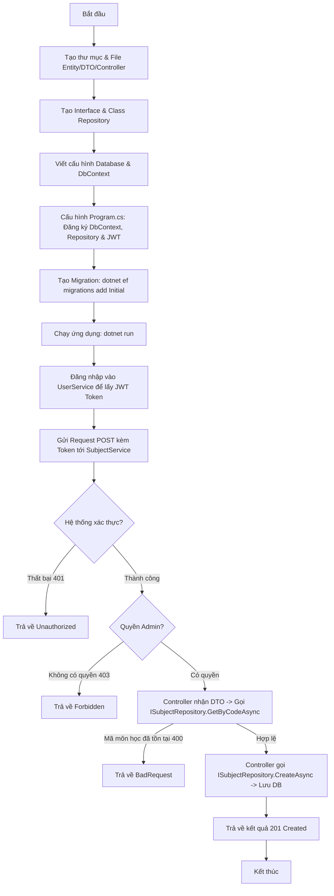

# Hướng Dẫn Chi Tiết Xây Dựng SubjectService (Sử Dụng Repository Pattern)

Tài liệu này hướng dẫn chi tiết từ lý thuyết thiết kế, cấu trúc thư mục, code mẫu hoàn chỉnh và lý do tại sao lại thiết kế như vậy đối với microservice **SubjectService** trong hệ thống **UniversityManagement**.

---

## 1. Kiến Trúc và Lý Do Thiết Kế

Hệ thống được thiết kế theo kiến trúc **Microservices**. Trong đó, `SubjectService` là dịch vụ độc lập chịu trách nhiệm quản lý danh mục môn học và chương trình học theo từng khối lớp (Khối 1 đến 12).

### Tại sao SubjectService cần Database riêng (`SubjectDb`)?
* **Tính tự trị (Autonomy):** Mỗi service quản lý cơ sở dữ liệu của riêng nó. Nếu `UserService` hay `ClassService` gặp sự cố, `SubjectService` vẫn có thể chạy bình thường để phục vụ các truy vấn môn học.
* **Độc lập deploy:** Thay đổi cấu trúc bảng môn học không ảnh hưởng hay yêu cầu deploy lại các service khác.

### Tại sao nên dùng Repository Pattern?
Thay vì viết trực tiếp truy vấn Entity Framework (`SubjectDbContext`) trong Controller, dự án này áp dụng **Repository Pattern**:
* **Tính đồng bộ (Consistency):** UserService và ClassService đã sử dụng Repository. Áp dụng cho SubjectService giúp dự án thống nhất một kiểu thiết kế (Design Pattern).
* **Tính dễ kiểm thử (Mockability/Testability):** Khi viết Unit Test cho Controller, ta có thể dễ dàng giả lập (Mock) Interface `ISubjectRepository` mà không cần kết nối tới database PostgreSQL thực tế.
* **Tính tách biệt trách nhiệm (Decoupling):** Controller chỉ lo nhiệm vụ phân phối HTTP request/response và phân quyền. Toàn bộ logic truy vấn database (SQL/EF Core) sẽ do Repository đảm nhận.

### Xác thực và Phân quyền bất đồng bộ (Decentralized JWT Auth)
* Chúng ta **không** gọi API trực tiếp sang `UserService` để kiểm tra tài khoản mỗi khi có người gọi vào `SubjectService`.
* Thay vào đó, `SubjectService` tự giải mã (decode) và xác thực tính hợp lệ của **JWT Bearer Token** bằng cấu hình khóa bí mật (`Jwt:Key`) và Issuer/Audience dùng chung.
* Các thông tin về quyền hạn (`Admin`, `Teacher`, `Student`) được đọc trực tiếp từ các Claims chứa trong Token để thực hiện phân quyền thông qua filter `[Authorize(Roles = "...")]`.

---

## 2. Cấu Trúc Thư Mục Dự Án

Dự án `SubjectService` sẽ được tổ chức theo cấu trúc chuẩn của một ASP.NET Core Web API sạch sẽ kết hợp Repository Pattern:

```text
SubjectService/
│
├── Properties/
│   └── launchSettings.json    # Cấu hình cổng chạy (Port 5187)
│
├── Entities/                  # Thực thể cơ sở dữ liệu (Database Models)
│   └── Subject.cs             # Thực thể Môn học
│
├── Data/                      # Tầng cấu hình kết nối DB (EF Core)
│   ├── SubjectDbContext.cs    # Lớp DbContext quản lý kết nối database
│   └── DbInitializer.cs       # Chèn dữ liệu mẫu khi khởi tạo ứng dụng
│
├── Repositories/              # Tầng truy xuất dữ liệu (Data Access Layer)
│   ├── ISubjectRepository.cs  # Interface định nghĩa các hàm truy xuất
│   └── SubjectRepository.cs   # Triển khai các hàm truy xuất thực tế với EF Core
│
├── DTOs/                      # Đối tượng truyền tải dữ liệu (Data Transfer Objects)
│   ├── CreateSubjectRequest.cs
│   ├── UpdateSubjectRequest.cs
│   └── SubjectResponse.cs
│
├── Controllers/               # Tầng định tuyến API Endpoints
│   └── SubjectController.cs   # API CRUD Môn học & Chương trình học
│
├── Middleware/                # Các bộ lọc/xử lý trung gian
│   └── ExceptionMiddleware.cs # Xử lý lỗi toàn cục (Global Exception Handler)
│
├── Program.cs                 # File cấu hình khởi chạy ứng dụng chính
├── appsettings.json           # File chứa cấu hình ConnectionString & JWT Key
└── SubjectService.csproj      # File cấu hình thư viện và build dự án
```

---

## 3. Chi Tiết Code & Giải Thích Từng File

### 3.1. Cấu hình dự án (`SubjectService.csproj`)
Chúng ta cần cài đặt các thư viện cần thiết cho việc kết nối PostgreSQL, Entity Framework Core và xác thực JWT.

```xml
<Project Sdk="Microsoft.NET.Sdk.Web">

  <PropertyGroup>
    <TargetFramework>net9.0</TargetFramework>
    <Nullable>enable</Nullable>
    <ImplicitUsings>enable</ImplicitUsings>
  </PropertyGroup>

  <ItemGroup>
    <PackageReference Include="Microsoft.AspNetCore.Authentication.JwtBearer" Version="9.0.9" />
    <PackageReference Include="Microsoft.AspNetCore.OpenApi" Version="9.0.9" />
    <PackageReference Include="Microsoft.EntityFrameworkCore" Version="9.0.9" />
    <PackageReference Include="Microsoft.EntityFrameworkCore.Design" Version="9.0.9">
      <IncludeAssets>runtime; build; native; contentfiles; analyzers; buildtransitive</IncludeAssets>
      <PrivateAssets>all</PrivateAssets>
    </PackageReference>
    <PackageReference Include="Npgsql.EntityFrameworkCore.PostgreSQL" Version="9.0.4" />
    <PackageReference Include="Scalar.AspNetCore" Version="2.16.3" />
  </ItemGroup>

</Project>
```
> [!NOTE]
> * **Scalar.AspNetCore:** Dùng thay thế cho Swashbuckle mặc định nhằm cung cấp giao diện tài liệu API đẹp và hiện đại hơn.
> * **Npgsql.EntityFrameworkCore.PostgreSQL:** Thư viện EF Core chính thức của PostgreSQL.

---

### 3.2. Cấu hình môi trường (`appsettings.json`)
Cấu hình kết nối tới database `SubjectDb` và khóa xác thực JWT (phải trùng khớp với cấu hình trong `UserService`).

```json
{
  "ConnectionStrings": {
    "DefaultConnection": "Host=localhost;Port=5432;Database=SubjectDb;Username=postgres;Password=123456"
  },
  "Jwt": {
    "Key": "SuperSecretKeyForJwtAuthenticationThatIsLongEnoughToAvoidErrors123456!",
    "Issuer": "UserService",
    "Audience": "UniversityManagement"
  },
  "Logging": {
    "LogLevel": {
      "Default": "Information",
      "Microsoft.AspNetCore": "Warning"
    }
  },
  "AllowedHosts": "*"
}
```

---

### 3.3. Thực thể môn học (`Entities/Subject.cs`)
Thực thể mô tả cấu trúc bảng `Subjects` trong database.

```csharp
using System;

namespace SubjectService.Entities;

public class Subject
{
    public Guid Id { get; set; }
    
    public string Code { get; set; } = string.Empty; // Ví dụ: TOAN10, VAN11, ANH12
    
    public string Name { get; set; } = string.Empty; // Ví dụ: Toán học, Ngữ văn
    
    public string Description { get; set; } = string.Empty;
    
    public int GradeLevel { get; set; } // Khối lớp từ 1 đến 12.
    
    public DateTime CreatedAt { get; set; } = DateTime.UtcNow;
}
```

---

### 3.4. Cấu hình Database (`Data/SubjectDbContext.cs`)
Quản lý thực thể và ánh xạ vào bảng PostgreSQL.

```csharp
using Microsoft.EntityFrameworkCore;
using SubjectService.Entities;

namespace SubjectService.Data;

public class SubjectDbContext : DbContext
{
    public SubjectDbContext(DbContextOptions<SubjectDbContext> options) : base(options) { }

    public DbSet<Subject> Subjects => Set<Subject>();

    protected override void OnModelCreating(ModelBuilder modelBuilder)
    {
        base.OnModelCreating(modelBuilder);
        
        // Tạo Index cho Code để tối ưu tốc độ tìm kiếm môn học
        modelBuilder.Entity<Subject>()
            .HasIndex(s => s.Code)
            .IsUnique();
    }
}
```

---

### 3.5. Dữ liệu mẫu khởi tạo (`Data/DbInitializer.cs`)
Tự động migrate và chèn sẵn danh mục môn học cơ bản nếu database trống.

```csharp
using System;
using System.Collections.Generic;
using System.Linq;
using System.Threading.Tasks;
using Microsoft.EntityFrameworkCore;
using SubjectService.Entities;

namespace SubjectService.Data;

public static class DbInitializer
{
    public static async Task SeedAsync(SubjectDbContext context)
    {
        // Tự động chạy Migration
        await context.Database.MigrateAsync();

        if (context.Subjects.Any())
        {
            return; // Nếu đã có môn học thì dừng lại
        }

        var subjects = new List<Subject>
        {
            // Khối 10
            new Subject { Id = Guid.Parse("00000000-0000-0000-0000-000000000011"), Code = "MATH10", Name = "Toán Học 10", Description = "Chương trình Toán lớp 10", GradeLevel = 10 },
            new Subject { Id = Guid.Parse("00000000-0000-0000-0000-000000000012"), Code = "LIT10", Name = "Ngữ Văn 10", Description = "Chương trình Ngữ văn lớp 10", GradeLevel = 10 },
            new Subject { Id = Guid.NewGuid(), Code = "ENG10", Name = "Tiếng Anh 10", Description = "Chương trình Tiếng Anh lớp 10", GradeLevel = 10 },
            new Subject { Id = Guid.NewGuid(), Code = "PHYS10", Name = "Vật Lý 10", Description = "Chương trình Vật lý lớp 10", GradeLevel = 10 },

            // Khối 11
            new Subject { Id = Guid.NewGuid(), Code = "MATH11", Name = "Toán Học 11", Description = "Chương trình Toán lớp 11", GradeLevel = 11 },
            new Subject { Id = Guid.NewGuid(), Code = "LIT11", Name = "Ngữ Văn 11", Description = "Chương trình Ngữ văn lớp 11", GradeLevel = 11 },
            new Subject { Id = Guid.NewGuid(), Code = "ENG11", Name = "Tiếng Anh 11", Description = "Chương trình Tiếng Anh lớp 11", GradeLevel = 11 },

            // Khối 12
            new Subject { Id = Guid.NewGuid(), Code = "MATH12", Name = "Toán Học 12", Description = "Chương trình Toán lớp 12", GradeLevel = 12 },
            new Subject { Id = Guid.NewGuid(), Code = "LIT12", Name = "Ngữ Văn 12", Description = "Chương trình Ngữ văn lớp 12", GradeLevel = 12 },
            new Subject { Id = Guid.NewGuid(), Code = "ENG12", Name = "Tiếng Anh 12", Description = "Chương trình Tiếng Anh lớp 12", GradeLevel = 12 }
        };

        await context.Subjects.AddRangeAsync(subjects);
        await context.SaveChangesAsync();
    }
}
```

---

### 3.6. Lớp truyền tải thông tin (`DTOs/SubjectRequests.cs`)
Giúp tách biệt Model của Database với Model nhận dữ liệu từ Client để tránh lộ thông tin và kiểm soát đầu vào dễ dàng.

```csharp
using System.ComponentModel.DataAnnotations;

namespace SubjectService.DTOs;

public class CreateSubjectRequest
{
    [Required(ErrorMessage = "Mã môn học là bắt buộc")]
    public string Code { get; set; } = string.Empty;

    [Required(ErrorMessage = "Tên môn học là bắt buộc")]
    [StringLength(100, MinimumLength = 2, ErrorMessage = "Tên môn học phải từ 2 đến 100 ký tự")]
    public string Name { get; set; } = string.Empty;

    public string Description { get; set; } = string.Empty;

    [Range(1, 12, ErrorMessage = "Khối lớp phải nằm trong khoảng từ 1 đến 12")]
    public int GradeLevel { get; set; }
}

public class UpdateSubjectRequest
{
    [Required(ErrorMessage = "Tên môn học là bắt buộc")]
    [StringLength(100, MinimumLength = 2, ErrorMessage = "Tên môn học phải từ 2 đến 100 ký tự")]
    public string Name { get; set; } = string.Empty;

    public string Description { get; set; } = string.Empty;

    [Range(1, 12, ErrorMessage = "Khối lớp phải nằm trong khoảng từ 1 đến 12")]
    public int GradeLevel { get; set; }
}

public class SubjectResponse
{
    public Guid Id { get; set; }
    public string Code { get; set; } = string.Empty;
    public string Name { get; set; } = string.Empty;
    public string Description { get; set; } = string.Empty;
    public int GradeLevel { get; set; }
    public DateTime CreatedAt { get; set; }
}
```

---

### 3.7. Lớp Repository (`Repositories/ISubjectRepository.cs` & `Repositories/SubjectRepository.cs`)
Định nghĩa interface và lớp triển khai cụ thể để giao tiếp với DbContext.

#### Interface: `Repositories/ISubjectRepository.cs`
```csharp
using System;
using System.Collections.Generic;
using System.Threading.Tasks;
using SubjectService.Entities;

namespace SubjectService.Repositories;

public interface ISubjectRepository
{
    Task<IEnumerable<Subject>> GetAllSubjectsAsync();
    Task<Subject?> GetSubjectByIdAsync(Guid id);
    Task<Subject?> GetSubjectByCodeAsync(string code);
    Task<Subject> CreateSubjectAsync(Subject subject);
    Task UpdateSubjectAsync(Subject subject);
    Task DeleteSubjectAsync(Guid id);
    Task SaveChangesAsync();
}
```

#### Triển khai thực tế: `Repositories/SubjectRepository.cs`
```csharp
using System;
using System.Collections.Generic;
using System.Linq;
using System.Threading.Tasks;
using Microsoft.EntityFrameworkCore;
using SubjectService.Data;
using SubjectService.Entities;

namespace SubjectService.Repositories;

public class SubjectRepository : ISubjectRepository
{
    private readonly SubjectDbContext _db;

    public SubjectRepository(SubjectDbContext db)
    {
        _db = db;
    }

    public async Task<IEnumerable<Subject>> GetAllSubjectsAsync()
    {
        return await _db.Subjects.ToListAsync();
    }

    public async Task<Subject?> GetSubjectByIdAsync(Guid id)
    {
        return await _db.Subjects.FindAsync(id);
    }

    public async Task<Subject?> GetSubjectByCodeAsync(string code)
    {
        return await _db.Subjects.FirstOrDefaultAsync(s => s.Code == code);
    }

    public async Task<Subject> CreateSubjectAsync(Subject subject)
    {
        await _db.Subjects.AddAsync(subject);
        return subject;
    }

    public Task UpdateSubjectAsync(Subject subject)
    {
        // Entity Framework Core theo dõi (track) sự thay đổi của thực thể trong bộ nhớ.
        // Hàm Update() chỉ đánh dấu thực thể là Modified, không ghi dữ liệu ngay.
        _db.Subjects.Update(subject);
        return Task.CompletedTask;
    }

    public async Task DeleteSubjectAsync(Guid id)
    {
        var subject = await _db.Subjects.FindAsync(id);
        if (subject != null)
        {
            _db.Subjects.Remove(subject);
        }
    }

    public async Task SaveChangesAsync()
    {
        await _db.SaveChangesAsync();
    }
}
```

---

### 3.8. Bộ điều khiển logic API (`Controllers/SubjectController.cs`)
Thực hiện các API nghiệp vụ gán phân quyền chi tiết cho Admin, Giáo viên và Học sinh thông qua việc tiêm và gọi các hàm từ `ISubjectRepository`.

```csharp
using System;
using System.Collections.Generic;
using System.Linq;
using System.Threading.Tasks;
using Microsoft.AspNetCore.Authorization;
using Microsoft.AspNetCore.Mvc;
using SubjectService.DTOs;
using SubjectService.Entities;
using SubjectService.Repositories;

namespace SubjectService.Controllers;

[ApiController]
[Route("api/subjects")]
[Authorize] // Bắt buộc đăng nhập
public class SubjectController : ControllerBase
{
    private readonly ISubjectRepository _subjectRepository;

    public SubjectController(ISubjectRepository subjectRepository)
    {
        _subjectRepository = subjectRepository;
    }

    // Lấy danh sách môn học (Student, Teacher, Admin đều được gọi)
    [HttpGet]
    public async Task<ActionResult<IEnumerable<SubjectResponse>>> GetAll([FromQuery] int? gradeLevel)
    {
        var subjects = await _subjectRepository.GetAllSubjectsAsync();

        // Lọc danh sách theo gradeLevel nếu client gửi lên
        if (gradeLevel.HasValue)
        {
            subjects = subjects.Where(s => s.GradeLevel == gradeLevel.Value);
        }

        var response = subjects.Select(s => new SubjectResponse
        {
            Id = s.Id,
            Code = s.Code,
            Name = s.Name,
            Description = s.Description,
            GradeLevel = s.GradeLevel,
            CreatedAt = s.CreatedAt
        });

        return Ok(response);
    }

    // Lấy chi tiết môn học theo Id
    [HttpGet("{id:guid}")]
    public async Task<ActionResult<SubjectResponse>> GetById(Guid id)
    {
        var subject = await _subjectRepository.GetSubjectByIdAsync(id);
        if (subject == null)
        {
            return NotFound(new { message = $"Không tìm thấy môn học với Id: {id}" });
        }

        return Ok(new SubjectResponse
        {
            Id = subject.Id,
            Code = subject.Code,
            Name = subject.Name,
            Description = subject.Description,
            GradeLevel = subject.GradeLevel,
            CreatedAt = subject.CreatedAt
        });
    }

    // Tạo môn học mới (Chỉ Admin mới có quyền)
    [HttpPost]
    [Authorize(Roles = "Admin")]
    public async Task<ActionResult<SubjectResponse>> Create([FromBody] CreateSubjectRequest request)
    {
        // Kiểm tra xem Code môn học đã tồn tại chưa
        var exists = await _subjectRepository.GetSubjectByCodeAsync(request.Code);
        if (exists != null)
        {
            return BadRequest(new { message = $"Mã môn học '{request.Code}' đã tồn tại" });
        }

        var subject = new Subject
        {
            Id = Guid.NewGuid(),
            Code = request.Code.ToUpper(),
            Name = request.Name,
            Description = request.Description,
            GradeLevel = request.GradeLevel,
            CreatedAt = DateTime.UtcNow
        };

        var createdSubject = await _subjectRepository.CreateSubjectAsync(subject);
        await _subjectRepository.SaveChangesAsync(); // Lưu thay đổi xuống cơ sở dữ liệu

        var response = new SubjectResponse
        {
            Id = createdSubject.Id,
            Code = createdSubject.Code,
            Name = createdSubject.Name,
            Description = createdSubject.Description,
            GradeLevel = createdSubject.GradeLevel,
            CreatedAt = createdSubject.CreatedAt
        };

        return CreatedAtAction(nameof(GetById), new { id = createdSubject.Id }, response);
    }

    // Cập nhật thông tin môn học (Chỉ Admin mới có quyền)
    [HttpPut("{id:guid}")]
    [Authorize(Roles = "Admin")]
    public async Task<IActionResult> Update(Guid id, [FromBody] UpdateSubjectRequest request)
    {
        var subject = await _subjectRepository.GetSubjectByIdAsync(id);
        if (subject == null)
        {
            return NotFound(new { message = $"Không tìm thấy môn học với Id: {id}" });
        }

        subject.Name = request.Name;
        subject.Description = request.Description;
        subject.GradeLevel = request.GradeLevel;

        await _subjectRepository.UpdateSubjectAsync(subject);
        await _subjectRepository.SaveChangesAsync(); // Lưu thay đổi xuống cơ sở dữ liệu

        return Ok(new SubjectResponse
        {
            Id = subject.Id,
            Code = subject.Code,
            Name = subject.Name,
            Description = subject.Description,
            GradeLevel = subject.GradeLevel,
            CreatedAt = subject.CreatedAt
        });
    }

    // Xóa môn học (Chỉ Admin mới có quyền)
    [HttpDelete("{id:guid}")]
    [Authorize(Roles = "Admin")]
    public async Task<IActionResult> Delete(Guid id)
    {
        var subject = await _subjectRepository.GetSubjectByIdAsync(id);
        if (subject == null)
        {
            return NotFound(new { message = $"Không tìm thấy môn học với Id: {id}" });
        }

        await _subjectRepository.DeleteSubjectAsync(id);
        await _subjectRepository.SaveChangesAsync(); // Lưu thay đổi xuống cơ sở dữ liệu

        return Ok(new { message = "Xóa môn học thành công" });
    }
}
```

---

### 3.9. Xử lý lỗi tập trung (`Middleware/ExceptionMiddleware.cs`)
Bộ lọc này chụp lại toàn bộ lỗi phát sinh không mong muốn trong service, log lại lỗi và trả về JSON chuẩn cho client thay vì quăng lỗi HTML thô gây mất an toàn thông tin.

```csharp
using System;
using System.Net;
using System.Text.Json;
using System.Threading.Tasks;
using Microsoft.AspNetCore.Http;
using Microsoft.Extensions.Logging;

namespace SubjectService.Middleware;

public class ExceptionMiddleware
{
    private readonly RequestDelegate _next;
    private readonly ILogger<ExceptionMiddleware> _logger;

    public ExceptionMiddleware(RequestDelegate next, ILogger<ExceptionMiddleware> logger)
    {
        _next = next;
        _logger = logger;
    }

    public async Task InvokeAsync(HttpContext context)
    {
        try
        {
            await _next(context);
        }
        catch (Exception ex)
        {
            _logger.LogError(ex, "Đã xảy ra lỗi hệ thống không mong muốn.");
            await HandleExceptionAsync(context, ex);
        }
    }

    private static Task HandleExceptionAsync(HttpContext context, Exception exception)
    {
        context.Response.ContentType = "application/json";
        context.Response.StatusCode = (int)HttpStatusCode.InternalServerError;

        var response = new
        {
            statusCode = context.Response.StatusCode,
            message = "Đã xảy ra lỗi hệ thống. Vui lòng liên hệ Admin để được hỗ trợ.",
            details = exception.Message // Tắt trường details khi deploy lên Production để bảo mật
        };

        var json = JsonSerializer.Serialize(response);
        return context.Response.WriteAsync(json);
    }
}
```

---

### 3.10. File cấu hình ứng dụng (`Program.cs`)
File cấu hình chính để khởi động ứng dụng, thiết lập DbContext, đăng ký Interface & Class Repository, cài đặt xác thực JWT, cấu hình tài liệu OpenAPI Scalar và thực hiện tự động migration dữ liệu.

```csharp
using System.Text;
using Microsoft.AspNetCore.Authentication.JwtBearer;
using Microsoft.EntityFrameworkCore;
using Microsoft.IdentityModel.Tokens;
using SubjectService.Data;
using SubjectService.Middleware;
using SubjectService.Repositories;
using Scalar.AspNetCore;

var builder = WebApplication.CreateBuilder(args);

// 1. Cấu hình kết nối PostgreSQL
builder.Services.AddDbContext<SubjectDbContext>(options =>
    options.UseNpgsql(builder.Configuration.GetConnectionString("DefaultConnection"))
);

// 2. Đăng ký Repository Pattern
builder.Services.AddScoped<ISubjectRepository, SubjectRepository>();

// 3. Cấu hình JWT Bearer Authentication
builder.Services.AddAuthentication(JwtBearerDefaults.AuthenticationScheme)
    .AddJwtBearer(options =>
    {
        options.TokenValidationParameters = new TokenValidationParameters
        {
            ValidateIssuer = true,
            ValidateAudience = true,
            ValidateLifetime = true,
            ValidateIssuerSigningKey = true,
            ValidIssuer = builder.Configuration["Jwt:Issuer"],
            ValidAudience = builder.Configuration["Jwt:Audience"],
            IssuerSigningKey = new SymmetricSecurityKey(
                Encoding.UTF8.GetBytes(builder.Configuration["Jwt:Key"]!)
            )
        };
    });

builder.Services.AddAuthorization();
builder.Services.AddControllers();
builder.Services.AddOpenApi(); // Hỗ trợ sinh tài liệu OpenAPI spec (.NET 9)

var app = builder.Build();

// 4. Sử dụng Exception Middleware toàn cục
app.UseMiddleware<ExceptionMiddleware>();

// Cấu hình tài liệu API Scalar khi chạy môi trường Development
if (app.Environment.IsDevelopment())
{
    app.MapOpenApi();
    app.MapScalarApiReference(); // Link chạy: http://localhost:5187/scalar/v1
}

app.UseAuthentication();
app.UseAuthorization();
app.MapControllers();

// 5. Tự động áp dụng Migration và Seed dữ liệu mẫu khi chạy ứng dụng
using (var scope = app.Services.CreateScope())
{
    var services = scope.ServiceProvider;
    try
    {
        var context = services.GetRequiredService<SubjectDbContext>();
        await DbInitializer.SeedAsync(context);
    }
    catch (Exception ex)
    {
        var logger = services.GetRequiredService<ILogger<Program>>();
        logger.LogError(ex, "Đã xảy ra lỗi trong quá trình Migration và Seed dữ liệu.");
    }
}

app.Run();
```

---

## 4. Quy Trình Vận Hành Một Chức Năng Bất Kỳ

Để bạn hình dung rõ cách triển khai thực tế, dưới đây là sơ đồ và các bước cụ thể đi từ **tạo thư mục** đến khi **chạy thử thành công** đối với chức năng: **"Tạo môn học mới (`POST /api/subjects`)"**.

### 4.1. Sơ đồ luồng hoạt động (Mermaid Flowchart)



---

### 4.2. Chi tiết các bước thực hiện từ khi Code đến khi Chạy thử

Giả sử chúng ta bắt đầu từ một thư mục giải pháp trống, quy trình tạo ra API **Tạo môn học mới** sẽ diễn ra từng bước như sau:

#### Bước 1: Khởi tạo Project qua Terminal
1. Mở Terminal tại thư mục cha `UniversityManagement`.
2. Tạo dự án WebAPI mới bằng lệnh .NET CLI:
   ```powershell
   dotnet new webapi -n SubjectService
   ```
3. Đưa dự án mới vào file Solution chung của hệ thống:
   ```powershell
   dotnet sln UniversityManagement.sln add SubjectService/SubjectService.csproj
   ```

#### Bước 2: Tạo các Thư mục & Thêm thư viện (NuGet packages)
1. Cài đặt các thư viện EF Core và JWT Bearer vào dự án qua terminal:
   ```powershell
   cd SubjectService
   dotnet add package Microsoft.AspNetCore.Authentication.JwtBearer
   dotnet add package Microsoft.EntityFrameworkCore
   dotnet add package Microsoft.EntityFrameworkCore.Design
   dotnet add package Npgsql.EntityFrameworkCore.PostgreSQL
   dotnet add package Scalar.AspNetCore
   ```
2. Tạo các thư mục con trong dự án `SubjectService`:
   * Tạo thư mục `Entities`
   * Tạo thư mục `Data`
   * Tạo thư mục `Repositories`
   * Tạo thư mục `DTOs`
   * Tạo thư mục `Controllers`
   * Tạo thư mục `Middleware`

#### Bước 3: Tạo và định nghĩa Thực thể (Entity)
1. Tạo file `Entities/Subject.cs`.
2. Định nghĩa các trường dữ liệu mà bảng `Subjects` trong cơ sở dữ liệu sẽ lưu trữ (Id, Code, Name, Description, GradeLevel).

#### Bước 4: Tạo và định nghĩa lớp truyền tải dữ liệu (DTO)
1. Tạo file `DTOs/SubjectRequests.cs`.
2. Định nghĩa class `CreateSubjectRequest` với các Annotation để bắt lỗi nhập liệu (ví dụ: `[Required]`, `[Range(1, 12)]`).

#### Bước 5: Tạo Interface & Triển khai lớp Repository
1. Tạo file `Repositories/ISubjectRepository.cs` và khai báo các phương thức CRUD như: `GetAllAsync`, `GetByIdAsync`, `GetByCodeAsync`, `CreateAsync`, `UpdateAsync`, `DeleteAsync`.
2. Tạo file `Repositories/SubjectRepository.cs` kế thừa từ `ISubjectRepository` và tiêm `SubjectDbContext` để viết các câu lệnh EF Core tương tác với PostgreSQL.

#### Bước 6: Cấu hình kết nối cơ sở dữ liệu (DbContext & DbInitializer)
1. Tạo file `Data/SubjectDbContext.cs` để quản lý và ánh xạ Entity `Subject` thành bảng CSDL.
2. Tạo file `Data/DbInitializer.cs` để viết code tự động migrate và nạp dữ liệu mẫu ban đầu.

#### Bước 7: Viết xử lý Logic API (Controller)
1. Tạo file `Controllers/SubjectController.cs`.
2. Tiêm `ISubjectRepository` vào constructor của Controller.
3. Viết phương thức `Create` với route `[HttpPost]` và gán bộ lọc phân quyền `[Authorize(Roles = "Admin")]`.
4. Trong phương thức `Create`, gọi `_subjectRepository.GetByCodeAsync` để kiểm tra trùng lặp `Code`. Nếu hợp lệ, gọi `_subjectRepository.CreateAsync` để lưu xuống DB và trả về mã HTTP `201 Created`.

#### Bước 8: Cấu hình chính của hệ thống (Program.cs & appsettings.json)
1. Mở `appsettings.json`, dán ConnectionString trỏ tới database `SubjectDb` và dán cấu hình JWT.
2. Mở `Program.cs`, thêm các dòng cấu hình:
   * Đăng ký DbContext với chuỗi kết nối.
   * Đăng ký Repository Pattern: `builder.Services.AddScoped<ISubjectRepository, SubjectRepository>();`
   * Đăng ký JWT Bearer Authentication và kích hoạt `app.UseAuthentication()` / `app.UseAuthorization()`.
   * Thêm đoạn code tự động chạy `DbInitializer.SeedAsync()` khi ứng dụng khởi chạy.

#### Bước 9: Tạo database và chạy thử (Migration & Run)
1. Sinh file Migration đầu tiên đại diện cho việc tạo bảng trong database:
   ```powershell
   dotnet ef migrations add InitialSubjectCreate
   ```
2. Chạy ứng dụng:
   ```powershell
   dotnet run
   ```
   *(Lúc này ứng dụng sẽ tự khởi động cổng 5187, tự động chạy Migration để tạo database `SubjectDb` trên PostgreSQL và nạp sẵn các môn học mẫu).*

#### Bước 10: Kiểm tra API bằng Swagger/Scalar UI
1. Truy cập giao diện tài liệu API tại: `http://localhost:5187/scalar/v1`.
2. Mở API `POST /api/auth/login` ở cổng `5156` (UserService) để đăng nhập bằng tài khoản Admin (`admin@school.edu.vn` / `Admin@123`). Copy chuỗi Token nhận được.
3. Quay lại trang Scalar ở cổng `5187`, nhấn vào nút **Authorize/Security**, dán Token đó vào.
4. Chọn API `POST /api/subjects`, nhập JSON môn học mới (ví dụ môn Vật Lý khối 12):
   ```json
   {
     "code": "PHYS12",
     "name": "Vật Lý 12",
     "description": "Chương trình Vật lý lớp 12",
     "gradeLevel": 12
   }
   ```
5. Nhấn **Send** và nhận kết quả trả về `201 Created` thành công cùng với ID vừa được tạo.

---

## 5. Tích Hợp RabbitMQ Giữa Các Microservices

Để các microservices giao tiếp bất đồng bộ (ví dụ: khi thêm/sửa/xóa môn học ở `SubjectService`, `ClassService` tự động đồng bộ danh sách môn học đệm để kiểm tra tính hợp lệ khi phân lớp học hoặc xếp thời khóa biểu), chúng ta sử dụng **MassTransit** kết hợp với **RabbitMQ**.

### Bước 1: Định nghĩa các Hợp đồng sự kiện (Event Contracts)
Tạo thư mục `Events` tại cả 2 service (`SubjectService` và `ClassService`) với namespace và tên class giống hệt nhau:

```csharp
// File: Events/SubjectEvents.cs
using System;

namespace Shared.Events;

public interface SubjectCreatedEvent
{
    Guid Id { get; }
    string Code { get; }
    string Name { get; }
    int GradeLevel { get; }
}

public interface SubjectUpdatedEvent
{
    Guid Id { get; }
    string Code { get; }
    string Name { get; }
    int GradeLevel { get; }
}

public interface SubjectDeletedEvent
{
    Guid Id { get; }
}
```

### Bước 2: Cấu hình Publisher tại `SubjectService`

1. Cài đặt thư viện:
   ```bash
   cd SubjectService
   dotnet add package MassTransit.RabbitMQ
   ```

2. Đăng ký MassTransit vào [Program.cs](file:///d:/ASP.NET/UniversityManagement/SubjectService/Program.cs):
   ```csharp
   using MassTransit;

   builder.Services.AddMassTransit(x =>
   {
       x.UsingRabbitMq((context, cfg) =>
       {
           cfg.Host(builder.Configuration["MessageBroker:Host"] ?? "localhost", "/", h =>
           {
               h.Username(builder.Configuration["MessageBroker:Username"] ?? "guest");
               h.Password(builder.Configuration["MessageBroker:Password"] ?? "guest");
           });
       });
   });
   ```

3. Thêm cấu hình trong `appsettings.json` của `SubjectService`:
   ```json
   "MessageBroker": {
     "Host": "localhost",
     "Username": "guest",
     "Password": "guest"
   }
   ```

4. Tiêm `IPublishEndpoint` và phát sự kiện từ `SubjectController.cs`:
   ```csharp
   private readonly ISubjectRepository _subjectRepository;
   private readonly IPublishEndpoint _publishEndpoint;

   public SubjectController(ISubjectRepository subjectRepository, IPublishEndpoint publishEndpoint)
   {
       _subjectRepository = subjectRepository;
       _publishEndpoint = publishEndpoint;
   }

   // Trong CreateSubject Action:
   await _publishEndpoint.Publish<SubjectCreatedEvent>(new
   {
       Id = subject.Id,
       Code = subject.Code,
       Name = subject.Name,
       GradeLevel = subject.GradeLevel
   });

   // Trong Update Action:
   await _publishEndpoint.Publish<SubjectUpdatedEvent>(new
   {
       Id = subject.Id,
       Code = subject.Code,
       Name = subject.Name,
       GradeLevel = subject.GradeLevel
   });

   // Trong Delete Action:
   await _publishEndpoint.Publish<SubjectDeletedEvent>(new { Id = id });
   ```

### Bước 3: Cấu hình Consumer tại `ClassService` để lưu bộ nhớ đệm (Local Cache)

1. Thêm bảng `CachedSubjects` vào `ClassService` để lưu danh sách môn học đệm.
2. Tạo Consumer để lắng nghe sự kiện:
   ```csharp
   // File: Consumers/SubjectCreatedConsumer.cs
   using MassTransit;
   using Shared.Events;
   // logic insert/update/delete vào database đệm của ClassService
   ```
3. Đăng ký Consumer trong `Program.cs` của `ClassService` tương tự như cách đăng ký `UserCreatedConsumer` trong file `guide_connect_microservice.md`.

